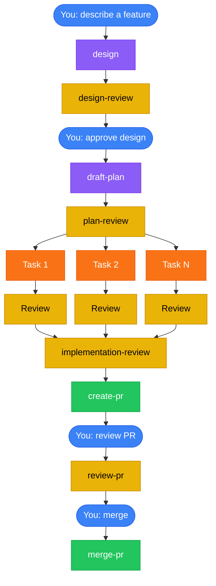

<div align="center">


# claude-caliper

**Measure twice, cut once.**

A Claude Code plugin that turns your goal into a PR with as little friction as possible. Every step is reviewed with a fresh context subagent. You get a design-reviewed, plan-validated, test-driven PR — with three human decisions.

[](LICENSE)
[](https://github.com/nikhilsitaram/claude-caliper/releases)
[](https://claude.ai/code)
[](skills/)

</div>

---

## The Problem

Many claude workflows are either improperly context engineered, overly complicated, or don't understand how to effectively use AI agents. This tool tries to be different. We don't lock Claude in a box, but we have fresh agents check work as it goes to ensure perfection.

## The Fix

Install claude-caliper. Describe what you want to build. Walk away.

The plugin installs 11 skills that fire automatically at the right moment, enforcing a full development workflow: **design before plan, plan before code, test before merge.** You make three decisions — approve the design, review the PR, and confirm the merge — and everything between runs as a chain of fresh subagents with zero manual handoffs.

---

## What a Session Looks Like

You say:

> "Add rate limiting middleware with per-route config and 429 responses with retry-after headers"

Then the pipeline runs:

| Step | What happens | Who |
|------|-------------|-----|
| 1 | Claude challenges your assumptions, proposes 2-3 approaches with trade-offs | You + Claude |
| 2 | You approve a design | **You** |
| 3 | Design review validates the doc against an 8-point checklist | Fresh subagent |
| 4 | Draft plan writes tasks with exact file paths, TDD steps, verification commands | Fresh subagent |
| 5 | Plan review catches vague steps, missing paths, design-plan drift | Fresh subagent |
| 6 | Orchestrator dispatches one fresh subagent per task, each running RED-GREEN-REFACTOR | Fresh subagents |
| 7 | Per-task reviewer checks each task (never the implementer) | Fresh subagents |
| 8 | Implementation review does a cross-task holistic pass | Fresh subagent |
| 9 | Create PR opens a PR | Automated |
| 10 | You review the PR and run `/review-pr` | **You** |
| 11 | Fresh-eyes review reads the diff cold before any external feedback | Fresh subagent |
| 12 | Fixes applied, feedback addressed | Automated |
| 13 | You run `/merge-pr` — squash merge, branch cleaned up | **You** |

Steps 3-9 run without any input from you.

---

## How It Works



<sup>Blue = human decisions (3 total) · Purple = creative work · Orange = TDD implementation · Yellow = review gates · Green = shipping</sup>

---

## Quick Start

### 1. Install

```bash
/plugin marketplace add nikhilsitaram/claude-caliper
/plugin install claude-caliper@claude-caliper
```

Restart Claude Code.

### 2. Use

Start a new session and describe something you want to build. The design skill fires automatically — no slash commands needed.

### 3. Verify

If Claude immediately starts discussing approaches and trade-offs instead of writing code, the plugin is working.

### Packages

Install only what you need:

| Package | What you get | Install command |
|---------|-------------|-----------------|
| **claude-caliper** | All 11 skills | `/plugin install claude-caliper@claude-caliper` |
| **claude-caliper-workflow** | Design-to-merge pipeline (9 skills) | `/plugin install claude-caliper-workflow@claude-caliper` |
| **claude-caliper-tooling** | Codebase review + skill eval (2 skills) | `/plugin install claude-caliper-tooling@claude-caliper` |

### Updating

Re-run the install command to update to the latest version. Claude Code compares your cached version against the declared version and pulls the new one.

---

## Skills Reference

### Pipeline (auto-triggered)

These skills chain automatically. You trigger the first one by describing what to build; the last one by saying "merge."

| Stage | Skill | What happens |
|-------|-------|-------------|
| **Design** | [design](skills/design/) | Challenges assumptions, proposes 2-3 approaches, asks you to pick one |
| **Design Gate** | [design-review](skills/design-review/) | 8-point validation: problem clarity, success criteria, architecture fit, scope alignment, handoff quality |
| **Planning** | [draft-plan](skills/draft-plan/) | Structured plan: `plan.json` manifest + per-task `.md` files with TDD steps, exact file paths, verification commands |
| **Plan Gate** | [plan-review](skills/plan-review/) | Catches vague steps, missing file paths, design-plan drift, the "Different Claude Test" |
| **Execution** | [orchestrate](skills/orchestrate/) | Dispatches fresh subagent per task running RED-GREEN-REFACTOR TDD; parallel phases via git worktrees |
| **Review Gate** | [implementation-review](skills/implementation-review/) | Cross-task holistic review — catches inconsistencies invisible to per-task reviewers |
| **Create PR** | [create-pr](skills/create-pr/) | Commits, rebases, tests, pushes, opens PR with structured summary |
| **Review PR** | [review-pr](skills/review-pr/) | Fresh-eyes review before reading external feedback, addresses comments, posts assessment |
| **Merge** | [merge-pr](skills/merge-pr/) | Confirms merge, squash merges, cleans up branches and worktrees |

### Standalone Tools

| Skill | Trigger | What it does |
|-------|---------|-------------|
| [codebase-review](skills/codebase-review/) | `/codebase-review [path]` | Whole-repo audit with parallel subagents per directory, cross-scope reconciliation, findings triaged by fix complexity |
| [skill-eval](skills/skill-eval/) | `/skill-eval` | Assertion-based grading, blind A/B comparison, adversarial scenarios, variance analysis |

---

## How It Works Under the Hood

<details>
<summary><strong>Why Fresh Context Matters</strong></summary>

When an agent reviews code it just wrote, it rationalizes problems away. It remembers *why* it made every choice, so every choice seems reasonable. This is the same bias code review between humans exists to counter.

claude-caliper spawns a **fresh subagent for every review**:

- The **task reviewer** never wrote the code it's reviewing
- The **implementation reviewer** never built any of the tasks it's checking
- The **review-pr reviewer** forms its own opinion before seeing external feedback
- The **design reviewer** and **plan reviewer** are always fresh agents with zero prior context

No agent ever reviews its own work.

</details>

<details>
<summary><strong>Spec-Driven + Test-Driven Development</strong></summary>

claude-caliper chains two disciplines that are usually practiced separately: **spec-driven development** (validate *what* to build) and **test-driven development** (validate *that* it works). The design doc defines observable success criteria; the plan maps those criteria to tasks; every task follows RED-GREEN-REFACTOR; the implementation review verifies the criteria are met by the final code.

### The Traceability Chain

```text
Design doc         → Success criteria (human-verifiable outcomes, not implementation details)
  ↓
Design review      → Validates criteria are complete, necessary, and implementation-independent
  ↓
Draft plan         → Maps each criterion to one or more tasks with verification commands
  ↓
Plan review        → Checks every criterion is covered by at least one task
  ↓
Task execution     → RED: write failing test → GREEN: make it pass → REFACTOR: clean up
  ↓
Task review        → Fresh subagent checks spec fidelity + code quality per task
  ↓
Implementation review → Verifies all success criteria met by the combined implementation
```

### What Success Criteria Look Like

In the design doc:

```markdown
## Success Criteria
- Users can authenticate via OAuth and receive a session token
- Rate-limited endpoints return 429 with a Retry-After header
- Failed auth attempts are logged with client IP and timestamp
```

These are behavioral outcomes — "users can X", "system does Y" — not implementation details like "JWT middleware installed." This matters because it lets the implementation review verify fulfillment without being anchored to a specific approach.

### How TDD Executes Per Task

Each task's `.md` file contains explicit RED-GREEN-REFACTOR cycles:

```markdown
### Step 1: Rate limit middleware

**RED:** Write test expecting 429 after 10 requests in 1 minute
  → Run: `npm test -- --grep "rate limit"` → expect FAIL (middleware doesn't exist)

**GREEN:** Implement sliding window rate limiter in src/middleware/rate-limit.ts
  → Run: `npm test -- --grep "rate limit"` → expect PASS

**REFACTOR:** Extract config to src/config/rate-limits.ts
  → Run: `npm test` → expect all PASS (no regressions)
```

The implementer subagent follows these cycles exactly — it writes the failing test first, confirms it fails, implements, confirms it passes. The task reviewer then verifies the test actually covers the behavior, not just the happy path.

### Automated Criteria Validation

Beyond TDD, `plan.json` supports machine-runnable success criteria at three levels:

```json
{
  "success_criteria": [
    {
      "run": "curl -s -o /dev/null -w '%{http_code}' localhost:3000/health",
      "expect_output": "200",
      "timeout": 10,
      "severity": "blocking"
    }
  ]
}
```

The orchestrator runs these automatically: task-level criteria after each task, phase-level after each phase, plan-level before marking the plan complete. A blocking failure stops the pipeline.

</details>

<details>
<summary><strong>Structured Plans</strong></summary>

Plans aren't freeform text. They're machine-readable artifacts validated by a schema checker before any LLM reviewer sees them.

### Directory Layout

```text
docs/plans/2026-03-21-rate-limiter/
├── design-rate-limiter.md  # Design doc with success criteria
├── plan.json               # Machine-readable manifest (source of truth)
├── plan.md                 # Auto-rendered from plan.json (never hand-edited)
├── phase-a/
│   ├── a1.md               # Full TDD steps, pitfalls + why, exact file paths
│   ├── a2.md
│   └── completion.md       # Filled by dispatcher after phase execution
└── phase-b/
    ├── b1.md
    └── completion.md
```

### plan.json — The Machine-Readable Manifest

Every task specifies exact files, a verification command, and a measurable end state:

```json
{
  "schema": 1,
  "status": "Not Yet Started",
  "workflow": "create-pr",
  "goal": "Add rate limiting with per-route config",
  "architecture": "Sliding window counter in Redis, middleware per route group",
  "tech_stack": "Node.js, Redis, Express",
  "phases": [
    {
      "letter": "A",
      "name": "Core middleware",
      "status": "Not Started",
      "depends_on": [],
      "tasks": [
        {
          "id": "A1",
          "name": "Rate limit middleware",
          "status": "pending",
          "depends_on": [],
          "files": {
            "create": ["src/middleware/rate-limit.ts", "src/config/rate-limits.ts"],
            "modify": ["src/app.ts"],
            "test": ["tests/middleware/rate-limit.test.ts"]
          },
          "verification": "npm test -- --grep 'rate limit'",
          "done_when": "10 requests in 1 min returns 429 with Retry-After header, 5/5 tests pass"
        }
      ]
    }
  ]
}
```

### Schema Validation

Before an LLM reviewer ever sees the plan, `scripts/validate-plan --schema` runs structural checks:

- All required fields present at every level
- Phase dependency graph is a valid DAG (BFS cycle detection)
- Task dependencies only reference same or earlier phases
- No duplicate task IDs or file paths across the entire plan
- Every task `.md` file exists and its H1 header matches `# {id}: {name}` exactly
- Every phase has a `completion.md` stub

This catches structural errors deterministically — no tokens spent on an LLM noticing a missing field.

### Auto-Rendered plan.md

`plan.md` is generated deterministically from `plan.json` — never hand-edited. It updates automatically whenever task or phase status changes during execution, giving you a live progress view:

```markdown
## Phase A — Core middleware
**Status:** In Progress

- [x] A1: Rate limit middleware — *429 with Retry-After, 5/5 tests pass*
- [ ] A2: Per-route config — *Routes load limits from config, 3/3 tests pass*
```

The litmus test for every task: *could a fresh Claude with zero codebase context execute this without asking a single clarifying question?*

</details>

<details>
<summary><strong>Parallel Phase Execution</strong></summary>

When a plan has independent phases, they don't wait in line. The orchestrator builds a dependency DAG from `plan.json` and dispatches independent phases concurrently:

- Each phase gets its own **git worktree** branched from the integration branch
- Phase PRs **squash merge** into the integration branch as they complete
- Before dispatching dependent phases, the orchestrator runs **reconciliation** — analyzing diffs and injecting impact notes into downstream task files
- The final PR merges the integration branch into main

Sequential plans execute one phase at a time. No special-casing needed — the DAG handles both cases.

</details>

<details>
<summary><strong>Codebase Review</strong></summary>

Most review tools look at diffs. `codebase-review` audits the whole repo in parallel — one Explore subagent per top-level directory, then a cross-scope reconciliation pass that catches duplication and naming drift the per-directory reviewers can't see.

```bash
/codebase-review              # entire repo
/codebase-review src/         # scoped to a directory
```

Findings are routed by **fix complexity**, not severity:

| Complexity | Route |
|-----------|-------|
| One-liner (any severity) | Inline fix via draft-plan |
| Medium refactor | GitHub issue or plan (your choice) |
| Large architectural | GitHub issue with analysis |

Categories: DRY, YAGNI, Simplicity & Efficiency, Refactoring Opportunities, Consistency.

</details>

<details>
<summary><strong>Skill Eval</strong></summary>

Skills degrade silently. A prompt tweak that looks better might fail on edge cases you didn't test. `skill-eval` quantifies the difference.

- **Assertion-based grading** — a grader subagent checks expected behaviors with cited evidence, not keyword matching
- **Blind A/B comparison** — before/after outputs scored on Content + Structure without knowing which is which
- **Adversarial scenarios** — deadline pressure, "skip testing," ambiguous requirements; surfaces enforcement gaps that positive evals miss
- **Variance analysis** — 3 runs per scenario, mean +/- stddev; distinguishes real improvements from noise

```bash
/skill-eval
```

</details>

---

## Design Principles

**Lean skills.** Each skill is under 1,000 words. Skills teach Claude what it doesn't already know — workflow gates, project conventions, quality thresholds. Every excess word displaces working memory from the actual task.

**Eval-driven.** Every skill change runs through `skill-eval` before shipping. Pass rate + blind comparison + variance. No guessing whether a rewrite helped.

**Quality gates, not suggestions.** The workflow stops at design review, plan review, and implementation review. These aren't optional checkpoints — they're where the most expensive rework gets prevented.

**Three human decisions.** You confirm the design direction, review the PR after feedback is addressed, and confirm the merge. Everything between is automated. This isn't about removing humans — it's about putting them at the highest-leverage decision points.

---

## FAQ

**Does it work with any language/framework?**
Yes. Skills are language-agnostic. They auto-detect test runners, respect project conventions, and work with any git repository.

**Can I stop after the plan?**
Yes. After approving the design, you choose: **Create PR** (execute and open PR for human review), **Merge PR** (execute, open PR, review, and merge), or **Plan only** (stop after planning).

**What if the design is wrong?**
The design skill waits for explicit approval. Say "needs changes" and iterate. Nothing proceeds until you approve.

**What about simple changes?**
The design can be a few sentences. "Single phase, two tasks, no dependency layers." The process scales down — but it still validates before executing, because "simple" changes are where unexamined assumptions cause the most wasted work.

**Does it modify my git workflow?**
It uses feature branches, worktrees for isolation, and squash merges. It never commits directly to main. All changes go through PRs.

**The design skill isn't firing — Claude just starts coding.**
Restart Claude Code after installing, then start a **new session**. Existing sessions don't pick up plugin changes. If it still doesn't fire, verify the plugin is loaded: run `/plugin` and check that claude-caliper appears in the list.

**How do I update to a newer version?**
Re-run `/plugin install claude-caliper@claude-caliper`. Claude Code compares your cached version against the declared version and pulls the update. Check the [releases page](https://github.com/nikhilsitaram/claude-caliper/releases) for changelogs.

---

## Requirements

- [Claude Code](https://claude.ai/code) with plugin support
- Git (for worktree-based parallel execution)

## License

[MIT](LICENSE)

## Author

[Nikhil Sitaram](https://github.com/nikhilsitaram)
