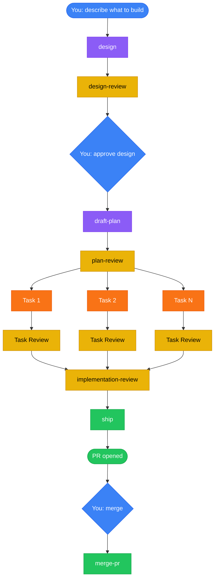

<div align="center">

# claude-caliper

**Measure twice, cut once.**

A Claude Code plugin that turns "build me X" into a design-reviewed, plan-validated, test-driven PR — with two human decisions.

[](LICENSE)
[](https://github.com/nikhilsitaram/claude-caliper/releases)
[](https://claude.ai/code)
[](skills/)

</div>

---

## The Problem

You describe a feature to Claude Code. It starts writing code immediately — no design discussion, no plan, no tests. When you ask it to plan first, the plan is vague: "update the relevant files" with no paths, no test strategy, no verification steps. Three files deep, something goes wrong, and you're back to square one.

## The Fix

Install claude-caliper. Describe what you want to build. Walk away.

The plugin installs 10 skills that fire automatically at the right moment, enforcing a full development workflow: **design before plan, plan before code, test before merge.** You make two decisions — approve the design, review the PR — and everything between runs as a chain of fresh subagents with zero manual handoffs.

---

## What a Session Looks Like

You say:

> "Add rate limiting middleware with per-route config and 429 responses with retry-after headers"

Then the pipeline runs:

| Step | What happens | Who |
|------|-------------|-----|
| 1 | Claude challenges your assumptions, proposes 2-3 approaches with trade-offs | You + Claude |
| 2 | You approve a design | **You** |
| 3 | Design review validates the doc against an 8-point checklist | Fresh subagent |
| 4 | Draft plan writes tasks with exact file paths, TDD steps, verification commands | Fresh subagent |
| 5 | Plan review catches vague steps, missing paths, design-plan drift | Fresh subagent |
| 6 | Orchestrator dispatches one fresh subagent per task, each running RED-GREEN-REFACTOR | Fresh subagents |
| 7 | Per-task reviewer checks each task (never the implementer) | Fresh subagents |
| 8 | Implementation review does a cross-task holistic pass | Fresh subagent |
| 9 | Ship opens a PR | Automated |
| 10 | You review the PR and run `/merge-pr` | **You** |

Steps 3-9 run without any input from you.

---

## How It Works



<sup>Blue = human decisions (2 total) · Purple = creative work · Orange = TDD implementation · Yellow = review gates · Green = shipping</sup>

---

## Quick Start

### 1. Install

```bash
/plugin marketplace add nikhilsitaram/claude-caliper
/plugin install claude-caliper@claude-caliper
```

Restart Claude Code.

### 2. Use

Start a new session and describe something you want to build. The design skill fires automatically — no slash commands needed.

### 3. Verify

If Claude immediately starts discussing approaches and trade-offs instead of writing code, the plugin is working.

---

## Skills Reference

### Pipeline (auto-triggered)

These skills chain automatically. You trigger the first one by describing what to build; the last one by saying "merge."

| Stage | Skill | What happens |
|-------|-------|-------------|
| **Design** | [design](skills/design/) | Challenges assumptions, proposes 2-3 approaches, asks you to pick one |
| **Design Gate** | [design-review](skills/design-review/) | 8-point validation: problem clarity, success criteria, architecture fit, scope alignment, handoff quality |
| **Planning** | [draft-plan](skills/draft-plan/) | Structured plan: `plan.json` manifest + per-task `.md` files with TDD steps, exact file paths, verification commands |
| **Plan Gate** | [plan-review](skills/plan-review/) | Catches vague steps, missing file paths, design-plan drift, the "Different Claude Test" |
| **Execution** | [orchestrate](skills/orchestrate/) | Dispatches fresh subagent per task running RED-GREEN-REFACTOR TDD; parallel phases via git worktrees |
| **Review Gate** | [implementation-review](skills/implementation-review/) | Cross-task holistic review — catches inconsistencies invisible to per-task reviewers |
| **Ship** | [ship](skills/ship/) | Commits, rebases, tests, pushes, opens PR with structured summary |
| **Merge** | [merge-pr](skills/merge-pr/) | Fresh-eyes review before reading external feedback, addresses comments, squash merges, cleans up |

### Standalone Tools

| Skill | Trigger | What it does |
|-------|---------|-------------|
| [codebase-review](skills/codebase-review/) | `/codebase-review [path]` | Whole-repo audit with parallel subagents per directory, cross-scope reconciliation, findings triaged by fix complexity |
| [skill-eval](skills/skill-eval/) | `/skill-eval` | Assertion-based grading, blind A/B comparison, adversarial scenarios, variance analysis |

---

## Why Fresh Context Matters

When an agent reviews code it just wrote, it rationalizes problems away. It remembers *why* it made every choice, so every choice seems reasonable. This is the same bias code review between humans exists to counter.

claude-caliper spawns a **fresh subagent for every review**:

- The **task reviewer** never wrote the code it's reviewing
- The **implementation reviewer** never built any of the tasks it's checking
- The **merge-pr reviewer** forms its own opinion before seeing external feedback
- The **design reviewer** and **plan reviewer** are always fresh agents with zero prior context

No agent ever reviews its own work.

---

## Structured Plans

Plans aren't freeform text. They're machine-readable artifacts with human-readable companions:

```text
docs/plans/2026-03-21-rate-limiter/
├── plan.json             # Source of truth: tasks, deps, files, verification commands
├── plan.md               # Auto-rendered from plan.json (never hand-edited)
├── phase-a/
│   ├── a1.md             # Full TDD steps, pitfalls, exact file paths
│   ├── a2.md
│   └── completion.md     # Filled by dispatcher after execution
└── phase-b/
    ├── b1.md
    └── completion.md
```

The litmus test: *could a fresh Claude with zero codebase context execute this task without asking a single clarifying question?*

---

## Parallel Phase Execution

When a plan has independent phases, they don't wait in line. The orchestrator builds a dependency DAG from `plan.json` and dispatches independent phases concurrently:

- Each phase gets its own **git worktree** branched from the integration branch
- Phase PRs **squash merge** into the integration branch as they complete
- Before dispatching dependent phases, the orchestrator runs **reconciliation** — analyzing diffs and injecting impact notes into downstream task files
- The final PR merges the integration branch into main

Sequential plans execute one phase at a time. No special-casing needed — the DAG handles both cases.

---

## Codebase Review

Most review tools look at diffs. `codebase-review` audits the whole repo in parallel — one Explore subagent per top-level directory, then a cross-scope reconciliation pass that catches duplication and naming drift the per-directory reviewers can't see.

```bash
/codebase-review              # entire repo
/codebase-review src/         # scoped to a directory
```

Findings are routed by **fix complexity**, not severity:

| Complexity | Route |
|-----------|-------|
| One-liner (any severity) | Inline fix via draft-plan |
| Medium refactor | GitHub issue or plan (your choice) |
| Large architectural | GitHub issue with analysis |

Categories: DRY, YAGNI, Simplicity & Efficiency, Refactoring Opportunities, Consistency.

---

## Skill Eval

Skills degrade silently. A prompt tweak that looks better might fail on edge cases you didn't test. `skill-eval` quantifies the difference.

- **Assertion-based grading** — a grader subagent checks expected behaviors with cited evidence, not keyword matching
- **Blind A/B comparison** — before/after outputs scored on Content + Structure without knowing which is which
- **Adversarial scenarios** — deadline pressure, "skip testing," ambiguous requirements; surfaces enforcement gaps that positive evals miss
- **Variance analysis** — 3 runs per scenario, mean +/- stddev; distinguishes real improvements from noise

```bash
/skill-eval
```

---

## Packages

Install only what you need:

| Package | What you get | Install command |
|---------|-------------|-----------------|
| **claude-caliper** | All 10 skills | `/plugin install claude-caliper@claude-caliper` |
| **claude-caliper-workflow** | Design-to-merge pipeline (8 skills) | `/plugin install claude-caliper-workflow@claude-caliper` |
| **claude-caliper-tooling** | Codebase review + skill eval (2 skills) | `/plugin install claude-caliper-tooling@claude-caliper` |

All packages require adding the marketplace source first: `/plugin marketplace add nikhilsitaram/claude-caliper`

---

## Design Principles

**Lean skills.** Each skill is under 1,000 words. Skills teach Claude what it doesn't already know — workflow gates, project conventions, quality thresholds. Every excess word displaces working memory from the actual task.

**Eval-driven.** Every skill change runs through `skill-eval` before shipping. Pass rate + blind comparison + variance. No guessing whether a rewrite helped.

**Quality gates, not suggestions.** The workflow stops at design review, plan review, and implementation review. These aren't optional checkpoints — they're where the most expensive rework gets prevented.

**Two human decisions.** You confirm the design direction and review the final PR. Everything between is automated. This isn't about removing humans — it's about putting them at the two highest-leverage decision points.

---

## FAQ

**Does it work with any language/framework?**
Yes. Skills are language-agnostic. They auto-detect test runners, respect project conventions, and work with any git repository.

**Can I stop after the plan?**
Yes. After approving the design, you choose: **Ship** (full auto), **Review only** (execute but don't auto-merge), or **Plan only** (stop after planning).

**What if the design is wrong?**
The design skill waits for explicit approval. Say "needs changes" and iterate. Nothing proceeds until you approve.

**What about simple changes?**
The design can be a few sentences. "Single phase, two tasks, no dependency layers." The process scales down — but it still validates before executing, because "simple" changes are where unexamined assumptions cause the most wasted work.

**Does it modify my git workflow?**
It uses feature branches, worktrees for isolation, and squash merges. It never commits directly to main. All changes go through PRs.

---

## Requirements

- [Claude Code](https://claude.ai/code) with plugin support
- Git (for worktree-based parallel execution)

## License

[MIT](LICENSE)

## Author

[Nikhil Sitaram](https://github.com/nikhilsitaram)
