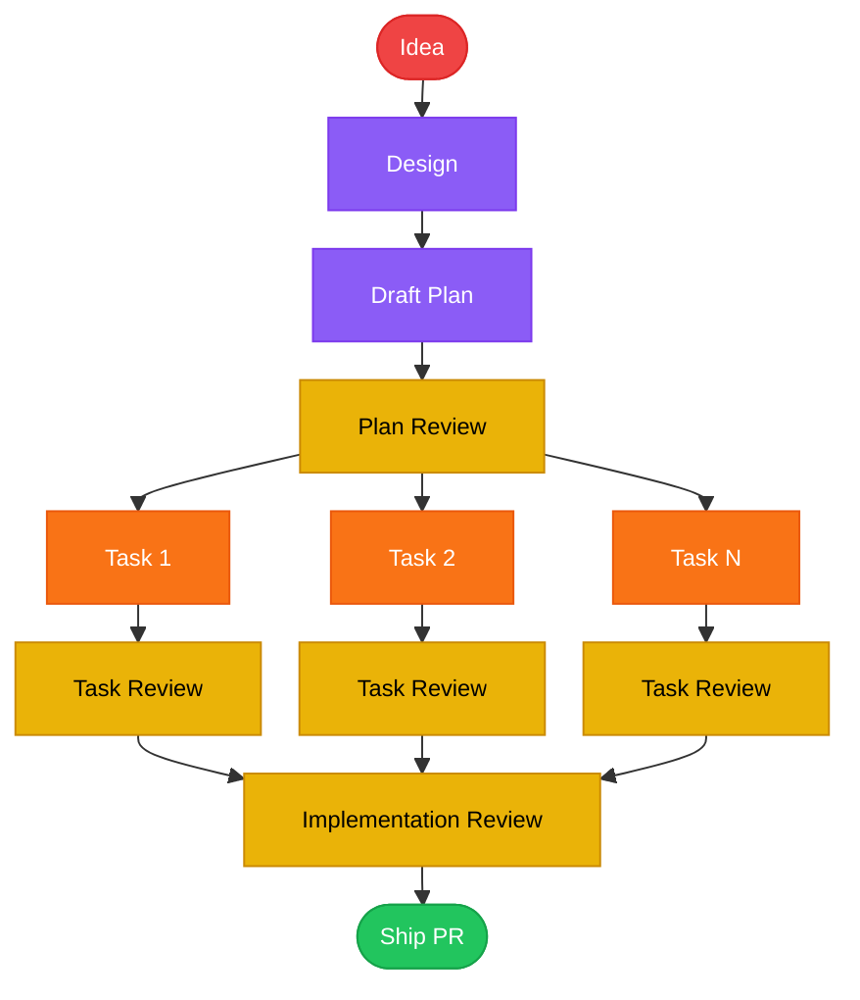

<div align="center">

# claude-caliper

**Measure twice, cut once.**

[](LICENSE)
[](https://claude.ai/code)
[](skills/)

</div>

---

Claude wants to write code immediately — before the design is agreed on, before the plan accounts for edge cases, before tests exist. When it does plan, the plans are too vague to execute without guessing.

claude-caliper installs a complete development workflow as skills that fire automatically at the right moment. Design before plan. Plan before code. Test before merge. Every time.

**Two human touchpoints: confirm the design, then review the PR.** Everything between — writing the plan, reviewing it, executing tasks with TDD, cross-task review, shipping — runs as a chain of fresh subagents with zero manual handoffs.



Every task gets a fresh implementer. Every review gets a fresh reviewer. No agent ever reviews its own work.

---

## Installation

```bash
/plugin marketplace add nikhilsitaram/claude-caliper
```

Then install the package that fits your needs:

| Package | Skills | Install |
|---------|--------|---------|
| `claude-caliper` | Everything | `/plugin install claude-caliper@claude-caliper` |
| `claude-caliper-workflow` | design, draft-plan, plan-review, orchestrate, implementation-review, ship, merge-pr | `/plugin install claude-caliper-workflow@claude-caliper` |
| `claude-caliper-tooling` | codebase-review, skill-eval | `/plugin install claude-caliper-tooling@claude-caliper` |

Then restart Claude Code.

**Verify:** Start a new session and describe something you want to build. Claude should trigger the design skill before writing a single line of code.

---

## The Pipeline

Skills fire automatically as your work progresses through each stage. You interact twice — once to confirm the design, once to review the PR.

| Skill | Invoked by | Does |
|-------|------------|------|
| [design](skills/design/) | 👤 You — describe something to build | Challenges assumptions, proposes 2-3 approaches, gets design sign-off; then dispatches the rest of the pipeline |
| [draft-plan](skills/draft-plan/) | 🤖 design (subagent) | Produces a task checklist with exact file paths, TDD steps, and runnable verification commands; supports phased plans when tasks have dependency layers |
| [plan-review](skills/plan-review/) | 🤖 draft-plan (subagent) | Validates completeness — catches vague steps and missing paths before execution starts |
| [orchestrate](skills/orchestrate/) | 🤖 draft-plan (subagent) | Dispatches fresh subagents per task, each running full RED→GREEN→REFACTOR; task review after every task; per-phase implementation review before advancing |
| [implementation-review](skills/implementation-review/) | 🤖 orchestrate (subagent) | Cross-task holistic review — catches inconsistencies a per-task reviewer can't see |
| [ship](skills/ship/) | 🤖 orchestrate (subagent) | Commits, pushes, opens PR with summary |
| [merge-pr](skills/merge-pr/) | 👤 You — after reviewing the PR | Addresses feedback, merges, cleans up branch and worktree |

---

## Differentiators

### Codebase Review

Most review tools look at diffs. `codebase-review` audits the whole repo in parallel — one Explore subagent per top-level directory, then a cross-scope reconciliation pass that catches duplication and naming drift the per-directory reviewers couldn't see.

Findings are triaged by fix complexity, not severity: a critical one-liner goes straight to `draft-plan`; a medium refactor across 10 files becomes a GitHub issue. No manual sorting.

```bash
/codebase-review          # entire repo
/codebase-review src/     # scoped to a directory
```

Categories: DRY · YAGNI · Simplicity & Efficiency · Refactoring Opportunities · Consistency

### Skill Eval

Skills degrade silently. A prompt tweak that looks like an improvement might drop pass rates on adversarial scenarios. `skill-eval` measures before you ship.

- **Assertion-based grading** — each eval defines expected behaviors; a grader subagent checks them with cited evidence, not keyword matching
- **Blind A/B comparison** — before/after outputs scored on Content + Structure without knowing which is which
- **Adversarial scenarios** — deadline pressure, "skip this step" prompts; these surface enforcement gaps that positive evals miss entirely
- **Variance analysis** — 3 runs per scenario, mean ± stddev; distinguishes real improvements from noise

```bash
/skill-eval               # interactive: picks skill, runs evals, reports delta
```

---

## Design Principles

**Lean by default.** Each skill is under 1,000 words. Skills teach Claude what it doesn't already know — workflow gates, project conventions, quality thresholds — not things it can reason from first principles.

**Eval-driven.** Every skill change runs through `skill-eval` before shipping. Pass rate + blind comparison + variance. No guessing whether the rewrite is better.

**Fresh context on every review.** Reviewers are always fresh subagents — they haven't written the code they're reviewing, so they can't rationalize away its problems. The implementer that built a task never reviews it. The implementation reviewer that checks all tasks never built any of them.

**Quality gates, not suggestions.** The workflow stops at design review, plan review, and implementation review. These aren't optional checkpoints — they're the moments that prevent the most rework.

---

## License

MIT
