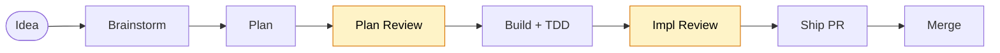

<div align="center">

# claude-caliper

**A Claude workflow that measures twice and cuts once.**

[](LICENSE)
[](https://claude.ai/code)
[](skills/)

</div>

---

Claude wants to write code immediately — before the design is agreed on, before the plan accounts for edge cases, before tests exist.

claude-caliper installs a complete development workflow as a set of skills that trigger automatically at the right moments. Design before plan. Plan before code. Test before merge.



Yellow nodes are quality gates — the workflow pauses here until the stage is solid.

---

## Installation

```bash
git clone https://github.com/nikhilsitaram/claude-caliper.git ~/personal/claude-caliper
```

Symlink the skills into Claude Code:

```bash
for skill in ~/personal/claude-caliper/skills/*/; do
  ln -sf "$skill" ~/.claude/skills/"$(basename "$skill")"
done
```

Or register as a plugin in a Claude Code session with `/plugin add`.

**Verify:** Start a new session and describe something you want to build. Claude should trigger the brainstorming skill before writing a single line of code.

---

## Skills

### The Pipeline

These skills fire automatically as your work progresses through each stage.

| Skill | Triggers when | Does |
|-------|---------------|------|
| [brainstorming](skills/brainstorming/) | You describe a feature or ask to build something | Explores alternatives, gets your sign-off on a design before any code |
| [writing-plans](skills/writing-plans/) | Design is approved | Breaks the design into tasks with exact file paths, TDD steps, and runnable verification commands |
| [plan-review](skills/plan-review/) | Plan is written | Validates completeness — catches vague steps and missing paths before execution starts |
| [orchestrating](skills/orchestrating/) | Plan passes review | Spawns parallel subagents per task, each running full TDD; two-stage review loop |
| [implementation-review](skills/implementation-review/) | All tasks complete | Cross-task holistic review before the PR opens |
| [ship](skills/ship/) | Implementation passes review | Commits, pushes, opens PR |
| [merge-pr](skills/merge-pr/) | PR is reviewed | Addresses CodeRabbit feedback, merges, cleans up branch and worktree |

### Quality Tools

| Skill | Does |
|-------|------|
| [test-driven-development](skills/test-driven-development/) | Enforces RED→GREEN→REFACTOR inside every task — writes the failing test first |
| [codebase-review](skills/codebase-review/) | Whole-repo audit for DRY, YAGNI, and complexity — parallel reviewers with cross-scope reconciliation |
| [skill-eval](skills/skill-eval/) | Assertion-based skill quality evals with blind A/B comparison across skill versions |

---

## Why this workflow

Most AI coding agents skip the slow parts — design, planning, review — because they're not in the happy path. When they do plan, the plans are too vague to execute without guessing. When they do review, it happens after the PR is already open.

claude-caliper adds structure at the moments that prevent the most rework:

- **Before any code** — design is approved by you, not assumed by the model
- **Before any execution** — the plan has exact file paths, runnable verification commands, and TDD steps written in advance
- **Before any PR** — implementation review catches cross-task inconsistencies a per-task reviewer would miss

**Lean by design.** Each skill is under 1,000 words. Skills teach Claude what it doesn't already know — workflow gates, project conventions — not things it can reason for itself.

**Eval-driven.** `skill-eval` measures skill output quality before changes ship, using assertion-based grading and blind A/B comparisons across skill versions.

---

## License

MIT
