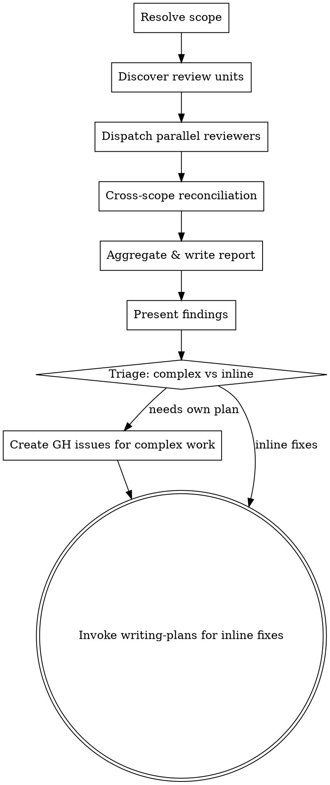

# Codebase Review Skill — Implementation Plan

> **For Claude:** REQUIRED SUB-SKILL: Use superpowers:subagent-driven-development to implement this plan task-by-task.

**Goal:** Create a `codebase-review` skill that audits an entire repository (or user-specified directory) for code quality issues across 5 categories, produces a ranked markdown report, creates GitHub issues for complex findings, and routes inline fixes through the normal superpowers pipeline.

**Architecture:** Single SKILL.md with embedded reviewer prompt template and process instructions. The skill dispatches parallel Explore subagents (one per top-level directory), runs a cross-scope reconciliation pass, aggregates findings into a persistent report, then triages: complex work → GH issues, inline fixes → writing-plans pipeline.

**Tech Stack:** Markdown skill file, bash (git/gh CLI), Claude Code Agent tool for parallel dispatch.

---

## Phases

### Phase 1 — Implement codebase-review skill
**Status:** Not Yet Started

- [ ] Task 1: Create SKILL.md with frontmatter and process documentation
- [ ] Task 2: Create reviewer-prompt.md template for parallel scope reviewers

> **Task 0 skipped:** Documentation-only skill with no cross-task data flow — all tasks create independent files with no imports or shared interfaces.
- [ ] Task 3: Create cross-scope-reviewer-prompt.md template for reconciliation pass
- [ ] Task 4: Add skill triggering test
- [ ] Task 5: Update README.md with new skill listing

---

## Task Details

### Task 1: Create SKILL.md with frontmatter and process documentation

**Files:**
- Create: `skills/codebase-review/SKILL.md`

**Verification:** `cat skills/codebase-review/SKILL.md | head -3` — should show valid YAML frontmatter with `name: codebase-review` and `description:` starting with "Use when"

**Done when:** SKILL.md exists with valid frontmatter (name, description under 1024 chars), all required sections (Overview, When to Use, Invocation, Review Categories, The Process, Report Format, Common Mistakes, Red Flags, Integration), and the process flow covers all design doc phases (scope resolution, parallel review, cross-scope reconciliation, aggregate/triage).

**Avoid:** Don't make the description a workflow summary — focus ONLY on triggering conditions per writing-skills convention. Don't exceed 1024 chars in the description field.

**Step 1: Write the SKILL.md file**

Create `skills/codebase-review/SKILL.md` with this content:

```markdown
---
name: codebase-review
description: Use when performing periodic codebase health audits, reviewing code quality across an entire repo or directory, or when asked to find DRY/YAGNI/simplicity/refactoring/consistency issues across a codebase
---

# Codebase Review

## Overview

Audit an entire codebase (or a specified directory) for code quality issues, produce a ranked report, and route fixes through the appropriate workflow.

**Core principle:** Periodic whole-repo audits catch issues that per-task and per-feature reviews miss — cross-module duplication, accumulated complexity, and style drift.

**Announce at start:** "I'm using the codebase-review skill to audit the codebase."

## When to Use

- Periodic codebase health checks ("review the codebase", "audit code quality")
- When asked to find DRY violations, dead code, unnecessary complexity, refactoring opportunities
- When asked to "simplify the codebase" or "clean up the code" at repo scale
- After many features have landed and quality may have drifted

**Not for:**
- Reviewing a specific feature branch → use `implementation-review`
- Reviewing changed files only → use built-in `/simplify`
- Per-task review during development → use `requesting-code-review`

## Invocation

`/codebase-review` — review entire repo (default)
`/codebase-review path/to/dir` — review only that directory

## Review Categories

| Category | What it checks | Criticality Range |
|----------|---------------|-------------------|
| **DRY** | Duplicated code blocks, repeated constants/magic numbers, copy-pasted logic with minor variations | Medium - High |
| **YAGNI** | Unused exports/functions, dead code paths, speculative features, unnecessary config options | Low - High |
| **Simplicity & Efficiency** | Over-abstracted code, unnecessary indirection, verbose implementations that could be simpler, premature generalization, redundant operations, suboptimal data structures | Medium - Critical |
| **Refactoring Opportunities** | SRP violations, deep nesting, long parameter lists, God objects, missing abstractions that would simplify multiple callers | Low - High |
| **Consistency** | Naming drift (camelCase vs snake_case mixed), inconsistent error handling, style divergence across modules | Low - Medium |

**Criticality levels:**
- **Critical** — Active bug risk or severe performance issue
- **High** — Significant maintenance burden or correctness risk
- **Medium** — Code smell that makes the codebase harder to work with
- **Low** — Minor style/convention issue

## The Process



### Phase 1 — Resolve Scope & Discover Review Units

1. If path argument provided, use that directory as the single review unit
2. If no argument, use git root: `git rev-parse --show-toplevel`
3. Discover top-level directories as review units:
   ```bash
   # List directories, excluding hidden dirs and common non-code dirs
   find "$SCOPE" -maxdepth 1 -type d ! -name '.*' ! -name 'node_modules' ! -name 'vendor' ! -name '__pycache__' | sort
   ```
4. Create one task per review unit using `TaskCreate`

### Phase 2 — Dispatch Parallel Reviewers

For each review unit, dispatch an **Explore** subagent using the `reviewer-prompt.md` template with:
- `{SCOPE_PATH}` — the directory to review

Categories and criticality levels are hardcoded in the template (they don't change per invocation).

All subagents run in parallel (no dependencies between them). Each returns structured findings.

### Phase 3 — Cross-Scope Reconciliation

After all Phase 2 subagents complete, dispatch one additional **Explore** subagent using `cross-scope-reviewer-prompt.md` with:
- `{ALL_FINDINGS}` — concatenated findings from all Phase 2 reviewers
- `{FILE_MANIFEST}` — list of all files in the repo with brief descriptions
- `{SCOPE_PATH}` — the root scope being reviewed

This subagent looks specifically for cross-directory issues that individual reviewers couldn't detect.

### Phase 4 — Aggregate, Report & Triage

1. Merge all findings (Phase 2 + Phase 3), deduplicate
2. Rank: Critical > High > Medium > Low, then by category
3. For each finding, classify fix complexity:
   - **Inline** — fixable in a few lines, no separate planning needed
   - **Needs own plan** — multi-file change, architectural decision, or requires its own brainstorming/design cycle
4. Write report to `docs/reviews/YYYY-MM-DD-codebase-review.md`
5. Present summary in conversation
6. For "needs own plan" items: use the `AskUserQuestion` tool (Claude Code built-in) to let user select which become GitHub issues, then create via `gh issue create`
7. For inline fixes: transition to `writing-plans` to create an implementation plan and run through the normal pipeline

## Report Format

```markdown
# Codebase Review — YYYY-MM-DD
**Scope:** [repo root or specified path]
**Review units:** [list of directories reviewed]

## Summary
- X findings total (N Critical, N High, N Medium, N Low)
- Y items deferred (need own plan → GH issues)
- Z items fixable inline (proceeding to implementation)

## Findings

### Critical
| # | Category | File(s) | Description | Fix Complexity |
|---|----------|---------|-------------|----------------|
| 1 | ... | ... | ... | Inline / Needs own plan |

### High
...

### Medium
...

### Low
...

## Deferred Work
| # | Finding | Rationale for deferral | GitHub Issue |
|---|---------|----------------------|--------------|
| ... | ... | ... | #NN |

## Methodology
Categories: DRY, YAGNI, Simplicity & Efficiency, Refactoring Opportunities, Consistency
Approach: Parallel scope review (N units) + cross-scope reconciliation
```

## Common Mistakes

### Reviewing only changed files
- **Problem:** Misses accumulated issues across the whole codebase
- **Fix:** Always review the full scope, not just recent diffs

### Severity-based issue creation
- **Problem:** Creating GH issues for all Critical/High findings regardless of fix complexity
- **Fix:** Issue creation is based on fix COMPLEXITY, not severity. A Critical one-liner doesn't need an issue.

### Skipping cross-scope reconciliation
- **Problem:** Cross-directory DRY violations and naming drift go undetected
- **Fix:** Always run the reconciliation pass after parallel reviews

## Red Flags

**Never:**
- Skip the cross-scope reconciliation pass
- Auto-create GH issues without user confirmation
- Route complex multi-file refactors through inline fixes
- Proceed to fixes without writing the report first

**Always:**
- Let the user decide which complex items become GH issues
- Write the report before starting any fixes
- Route inline fixes through writing-plans (not ad-hoc edits)

## Integration

**Standalone skill** — invoked directly by the user.

**Leads to:**
- **writing-plans** — for inline fixes after the review
- **GitHub Issues** — for complex work that needs its own brainstorming cycle

**Related but different:**
- **implementation-review** — reviews a feature branch, not the whole codebase
- **`/simplify` (built-in)** — reviews changed files only, no persistent report
```

**Step 2: Verify the file**

Run: `head -5 skills/codebase-review/SKILL.md`
Expected: YAML frontmatter with `name: codebase-review`

**Step 3: Commit**

```bash
git add skills/codebase-review/SKILL.md
git commit -m "feat: add codebase-review skill SKILL.md"
```

---

### Task 2: Create reviewer-prompt.md template for parallel scope reviewers

**Files:**
- Create: `skills/codebase-review/reviewer-prompt.md`

**Verification:** `grep -c '{SCOPE_PATH}' skills/codebase-review/reviewer-prompt.md` — should return at least 1

**Done when:** Template exists with `{SCOPE_PATH}` placeholder and hardcoded category/criticality definitions inline, instructs the Explore subagent to check all 5 categories, and specifies the structured output format (category, criticality, fix complexity, files, lines, description, recommended action).

**Avoid:** Don't include cross-scope instructions in this template — that's the cross-scope reviewer's job. Don't use model: "opus" — Explore subagents use the default model.

**Step 1: Write the reviewer-prompt.md file**

Create `skills/codebase-review/reviewer-prompt.md` with this content:

````markdown
# Codebase Review — Scope Reviewer Prompt Template

Use this template when dispatching parallel Explore subagents for each review unit.

**Purpose:** Review a single directory/module for code quality issues across all 5 categories.

**Dispatch one per review unit** — all run in parallel.

```
Agent tool (Explore):
  description: "Review {SCOPE_PATH} for code quality"
  prompt: |
    You are reviewing the code in {SCOPE_PATH} for quality issues.

    ## Your Scope

    Review ALL files under {SCOPE_PATH}. Read every file.
    Focus on finding concrete issues, not theoretical concerns.

    ## Categories to Check

    Check for issues in each of these categories:

    ### 1. DRY (Don't Repeat Yourself)
    - Duplicated code blocks (same or near-identical logic in multiple places)
    - Repeated constants or magic numbers
    - Copy-pasted logic with minor variations that should be a shared function

    ### 2. YAGNI (You Aren't Gonna Need It)
    - Unused exports, functions, or classes (defined but never imported/called)
    - Dead code paths (unreachable branches, commented-out code)
    - Speculative features or unnecessary config options
    - Over-parameterized functions where only one call pattern is ever used

    ### 3. Simplicity & Efficiency
    - Over-abstracted code (wrapper functions that add no value, unnecessary indirection layers)
    - Verbose implementations that could be significantly simpler
    - Premature generalization (generic framework for a single use case)
    - Redundant operations (read-then-read-again, unnecessary loops)
    - Suboptimal data structures or algorithms where better options are obvious

    ### 4. Refactoring Opportunities
    - Functions doing too much (SRP violations)
    - Deep nesting (3+ levels of conditionals/loops)
    - Long parameter lists (5+ parameters)
    - God objects (classes/modules with too many responsibilities)
    - Missing abstractions that would simplify multiple callers

    ### 5. Consistency
    - Naming drift (camelCase vs snake_case mixed within the scope)
    - Inconsistent error handling patterns
    - Style divergence between files in the same module

    ## Criticality Levels

    Rate each finding:
    - **Critical** — Active bug risk or severe performance issue
    - **High** — Significant maintenance burden or correctness risk
    - **Medium** — Code smell that makes the codebase harder to work with
    - **Low** — Minor style/convention issue

    ## Fix Complexity Classification

    For each finding, classify the fix:
    - **Inline** — fixable in a few lines within this scope, no planning needed
    - **Needs own plan** — multi-file change, architectural decision, or requires its own design/brainstorming cycle

    ## Output Format

    Return findings as a structured list. For each finding:

    **Finding N:**
    - **Category:** [DRY | YAGNI | Simplicity & Efficiency | Refactoring Opportunities | Consistency]
    - **Criticality:** [Critical | High | Medium | Low]
    - **Fix Complexity:** [Inline | Needs own plan]
    - **File(s):** [exact file paths with line numbers]
    - **Description:** [what the issue is, concretely]
    - **Recommended Action:** [specific fix suggestion]

    ## Rules

    - Be concrete — cite file:line, not vague descriptions
    - Only report real issues you can point to in the code
    - Do NOT invent problems to fill the report
    - If you find zero issues in a category, say "No issues found" for that category
    - Do NOT modify any files. Read-only review.
```
````

**Step 2: Verify the template**

Run: `grep '{SCOPE_PATH}' skills/codebase-review/reviewer-prompt.md | head -3`
Expected: Multiple lines containing the placeholder

**Step 3: Commit**

```bash
git add skills/codebase-review/reviewer-prompt.md
git commit -m "feat: add scope reviewer prompt template for codebase-review"
```

---

### Task 3: Create cross-scope-reviewer-prompt.md template for reconciliation pass

**Files:**
- Create: `skills/codebase-review/cross-scope-reviewer-prompt.md`

**Verification:** `grep -c '{ALL_FINDINGS}' skills/codebase-review/cross-scope-reviewer-prompt.md` — should return at least 1

**Done when:** Template exists with 3 placeholders (`{ALL_FINDINGS}`, `{FILE_MANIFEST}`, `{SCOPE_PATH}`), instructs the subagent to look specifically for cross-directory issues (DRY across modules, naming drift, duplicated patterns), and specifies the same structured output format as the scope reviewer.

**Avoid:** Don't re-check within-scope issues — the scope reviewers already handled those. Focus exclusively on cross-boundary issues.

**Step 1: Write the cross-scope-reviewer-prompt.md file**

Create `skills/codebase-review/cross-scope-reviewer-prompt.md` with this content:

````markdown
# Codebase Review — Cross-Scope Reconciliation Prompt Template

Use this template after all parallel scope reviewers have completed.

**Purpose:** Catch cross-directory issues that individual scope reviewers couldn't detect — duplication across modules, naming drift between directories, and patterns that only emerge when viewing the codebase holistically.

**Dispatch once** — after all scope reviewers return.

```
Agent tool (Explore):
  description: "Cross-scope reconciliation for codebase review"
  prompt: |
    You are performing a cross-scope reconciliation pass on a codebase review.
    Individual reviewers have already checked each directory independently.
    Your job is to find issues that ONLY become visible when looking across
    directory boundaries.

    ## Scope

    The review covers: {SCOPE_PATH}

    ## Findings from Individual Reviewers

    {ALL_FINDINGS}

    ## File Manifest

    {FILE_MANIFEST}

    ## What to Look For

    Focus EXCLUSIVELY on cross-boundary issues:

    ### 1. Cross-Directory DRY Violations
    - Same logic implemented in different directories under different names
    - Same constant or magic number defined independently in multiple modules
    - Utility functions that exist in one module but are reimplemented in another
    - Similar patterns that should be extracted to a shared location

    ### 2. Cross-Directory Naming Inconsistencies
    - Same concept named differently across modules (e.g., "user" vs "account" vs "profile")
    - Naming conventions that differ between directories (camelCase in one, snake_case in another)
    - Config keys or environment variables with inconsistent naming patterns

    ### 3. Cross-Directory Pattern Divergence
    - Error handling done differently in different modules
    - Logging patterns inconsistent across directories
    - API/interface contracts that don't match between producer and consumer modules

    ### 4. Duplicated Findings
    - Check if individual reviewers flagged the same issue independently (confirms it's real)
    - Deduplicate findings that describe the same underlying problem

    ## Criticality Levels

    Rate each finding:
    - **Critical** — Active bug risk or severe performance issue
    - **High** — Significant maintenance burden or correctness risk
    - **Medium** — Code smell that makes the codebase harder to work with
    - **Low** — Minor style/convention issue

    ## Fix Complexity Classification

    For each finding, classify the fix:
    - **Inline** — fixable in a few lines, no planning needed
    - **Needs own plan** — multi-file change, architectural decision, or requires its own design/brainstorming cycle

    ## Output Format

    **Cross-Scope Finding N:**
    - **Category:** [Cross-Directory DRY | Cross-Directory Naming | Cross-Directory Pattern Divergence]
    - **Criticality:** [Critical | High | Medium | Low]
    - **Fix Complexity:** [Inline | Needs own plan]
    - **File(s):** [exact file paths with line numbers, spanning multiple directories]
    - **Description:** [what the issue is, with specific references to both sides]
    - **Recommended Action:** [specific fix suggestion]

    **Duplicates Found:**
    - [List any findings from individual reviewers that describe the same underlying issue]

    ## Rules

    - ONLY report cross-boundary issues. Within-scope issues are already covered.
    - Be concrete — cite file:line from BOTH sides of the boundary
    - Read actual files to verify suspected cross-scope issues
    - If you find zero cross-scope issues, say so — don't invent problems
    - Do NOT modify any files. Read-only review.
```
````

**Step 2: Verify the template**

Run: `grep '{ALL_FINDINGS}' skills/codebase-review/cross-scope-reviewer-prompt.md`
Expected: At least one line containing the placeholder

**Step 3: Commit**

```bash
git add skills/codebase-review/cross-scope-reviewer-prompt.md
git commit -m "feat: add cross-scope reconciliation prompt for codebase-review"
```

---

### Task 4: Add skill triggering test

**Files:**
- Create: `tests/skill-triggering/prompts/codebase-review.txt`
- Modify: `tests/skill-triggering/run-all.sh:10-16` — add "codebase-review" to SKILLS array

**Verification:** `grep 'codebase-review' tests/skill-triggering/run-all.sh` — should show the skill in the SKILLS array

**Done when:** A test prompt file exists that would naturally trigger the codebase-review skill without mentioning it by name. The skill is added to the SKILLS array in run-all.sh.

**Avoid:** Don't mention "codebase-review" in the prompt text — the test verifies that natural language triggers the skill.

**Step 1: Write the test prompt**

Create `tests/skill-triggering/prompts/codebase-review.txt` with this content:

```text
I want to do a full code quality audit of this repo. Check for duplicated code, dead code, unnecessary complexity, and anything that could be simplified or refactored. Give me a report of everything you find.
```

**Step 2: Add to run-all.sh SKILLS array**

In `tests/skill-triggering/run-all.sh`, add `"codebase-review"` to the SKILLS array. The array currently looks like:

```bash
SKILLS=(
    "systematic-debugging"
    "test-driven-development"
    "writing-plans"
    "dispatching-parallel-agents"
    "requesting-code-review"
)
```

Add `"codebase-review"` as the last entry:

```bash
SKILLS=(
    "systematic-debugging"
    "test-driven-development"
    "writing-plans"
    "dispatching-parallel-agents"
    "requesting-code-review"
    "codebase-review"
)
```

**Step 3: Verify**

Run: `grep 'codebase-review' tests/skill-triggering/run-all.sh`
Expected: Shows `"codebase-review"` in the array

**Step 4: Commit**

```bash
git add tests/skill-triggering/prompts/codebase-review.txt tests/skill-triggering/run-all.sh
git commit -m "test: add skill triggering test for codebase-review"
```

---

### Task 5: Update README.md with new skill listing

**Files:**
- Modify: `README.md:109-118` — add codebase-review to the Collaboration section

**Verification:** `grep 'codebase-review' README.md` — should show the skill listed

**Done when:** README.md lists codebase-review in the Skills Library section under Collaboration, with a one-line description matching the skill's purpose.

**Avoid:** Don't change any other part of the README. Don't add a new section — codebase-review fits under Collaboration.

**Step 1: Add to README**

In `README.md`, in the **Collaboration** section of the Skills Library (after the `merge-pr` line and before `subagent-driven-development`), add:

```markdown
- **codebase-review** - Whole-repo code quality audit with parallel review, ranked report, and fix routing
```

**Step 2: Verify**

Run: `grep 'codebase-review' README.md`
Expected: Shows the skill listing

**Step 3: Commit**

```bash
git add README.md
git commit -m "docs: add codebase-review to README skills listing"
```
