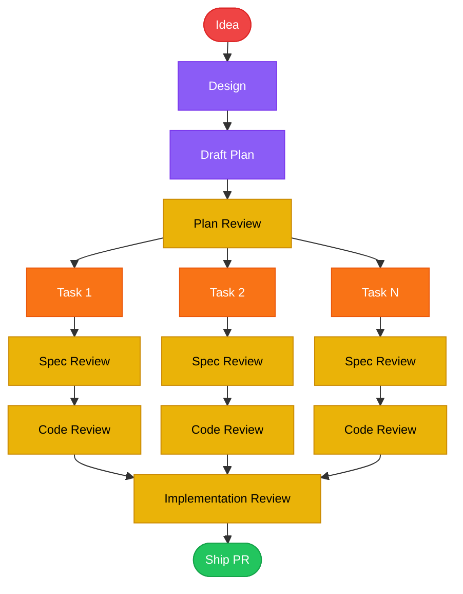
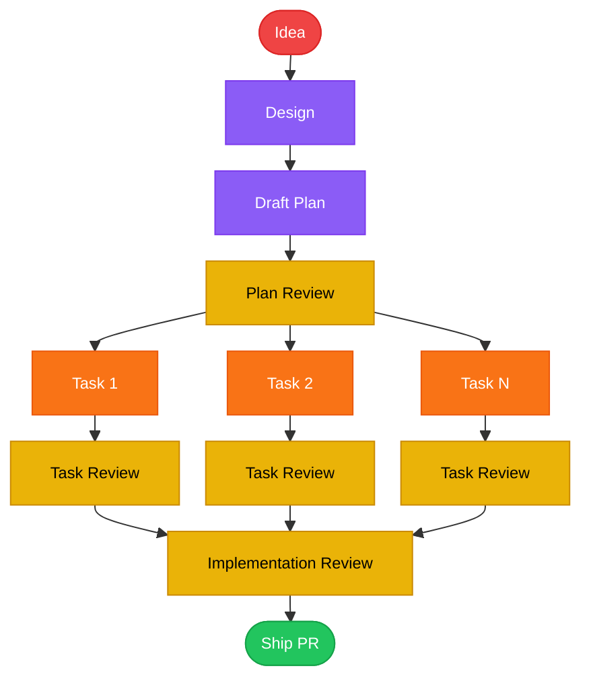

# Unified Task Reviewer Implementation Plan

> **For Claude:** REQUIRED SUB-SKILL: Use orchestrate

**Goal:** Replace the two per-task reviewers (spec compliance + code quality) with a single Opus task reviewer that follows the repo's checklist-driven review framework, cutting per-task review dispatches in half.

**Architecture:** Create `task-reviewer-prompt.md` with a 6-point checklist matching the design doc's spec. Update `phase-dispatcher-prompt.md` to dispatch one reviewer instead of two sequential ones. Update `SKILL.md` hierarchy diagram and template table. Update `README.md` mermaid diagram. Delete the two old reviewer prompts. Bump plugin version.

**Tech Stack:** Markdown prompt templates, Mermaid diagrams

---

## Phase A — Unified Task Reviewer
**Status:** Not Started | **Rationale:** All changes are tightly coupled — the new reviewer, dispatcher update, SKILL.md update, and README update form a single coherent unit with no natural verification gate between them. The old prompts can only be deleted after the dispatcher stops referencing them.

### Phase A Checklist
- [ ] A1: Create unified task reviewer prompt
- [ ] A2: Update phase dispatcher to use single reviewer
- [ ] A3: Update orchestrate SKILL.md
- [ ] A4: Update README mermaid diagram
- [ ] A5: Delete old reviewer prompts and bump version

### Phase A Completion Notes
<!-- Written by dispatcher after all tasks complete.
     Implementation review changes appended here by orchestrator. -->

### Phase A Tasks

#### A1: Create unified task reviewer prompt
**Files:**
- Create: `skills/orchestrate/task-reviewer-prompt.md`

**Verification:** `cat skills/orchestrate/task-reviewer-prompt.md | wc -w` (should be under 800 words — prompt templates should be concise)

**Done when:** `task-reviewer-prompt.md` exists with: (1) Opus model in dispatch block, (2) 6-point checklist matching design doc categories (Spec Fidelity, TDD Discipline, Test Quality, Code Correctness, Security, Simplicity), (3) output format with Issues Found section, PASS/FAIL assessment table, issue count + severity, and verdict, (4) variables section listing TASK_ID, TASK_SPEC, IMPLEMENTER_REPORT, BASE_SHA, HEAD_SHA, REPO_PATH.

**Avoid:** Duplicating implementation-review's cross-task categories (inconsistencies, duplication, integration gaps, dead code) — the task reviewer is scoped to single-task concerns only. Overlap would cause redundant findings and wasted reviewer tokens.

**Step 1: Write the prompt file**

Create `skills/orchestrate/task-reviewer-prompt.md` with the following structure, matching the dispatch format used by other reviewer prompts in this repo (see `skills/plan-review/reviewer-prompt.md` and `skills/implementation-review/reviewer-prompt.md` for the pattern):

```markdown
# Task Reviewer Prompt Template

Dispatch an Opus reviewer subagent to evaluate a single task's implementation. Dispatched by the phase dispatcher after each implementer completes.

```text
Agent tool (general-purpose):
  model: "opus"
  mode: "bypassPermissions"
  description: "Review Task {TASK_ID}"
  prompt: |
    You are reviewing a single task's implementation with fresh eyes.
    You have not seen the implementation rationale — evaluate the code cold.

    ## Task Specification

    {TASK_SPEC}

    ## Implementer Report

    {IMPLEMENTER_REPORT}

    Do not trust the report at face value. Verify every claim by reading
    actual code. The report is a starting point, not evidence.

    ## Git Range

    The code is at {REPO_PATH}

    ```bash
    git diff --stat {BASE_SHA}..{HEAD_SHA}
    git diff {BASE_SHA}..{HEAD_SHA}
    ```

    Read every file in the diff.

    ## 6-Point Checklist

    Work through each systematically. This review covers single-task
    concerns only — cross-task issues (inconsistencies, duplication,
    integration gaps) are handled by implementation-review afterward.

    ### 1. Spec Fidelity
    Compare the diff to the task spec line by line.

    - Every requirement in the spec has a corresponding code change
    - No extra features beyond what the spec requests
    - No misinterpretations of requirements

    - Flag: Requirement in spec with no corresponding implementation
    - Flag: Code change with no corresponding requirement (scope creep)
    - Flag: Implementation that doesn't match the spec's intent

    ### 2. TDD Discipline
    Check commit history within the diff range.

    ```bash
    git log --oneline {BASE_SHA}..{HEAD_SHA}
    ```

    - Commits show red→green→refactor pattern
    - Tests exist before or alongside implementation (not after)
    - Verification steps weren't skipped

    - Flag: Implementation commit with no preceding test commit
    - Flag: All code in a single commit (no TDD cycle visible)

    ### 3. Test Quality
    Read every test file in the diff.

    - Tests verify behavior, not implementation details
    - Edge cases covered (empty inputs, boundaries, error paths)
    - No mocking the thing under test
    - Assertions are specific (not just "no error thrown")

    - Flag: Test that mocks the module it's supposed to test
    - Flag: Missing edge case coverage for obvious boundaries
    - Flag: Assertion that passes vacuously

    ### 4. Code Correctness
    Read every implementation file in the diff.

    - Logic is correct for all input ranges
    - Error paths handled (not just happy path)
    - No off-by-one errors, race conditions, or incorrect assumptions
    - Resource cleanup (files closed, connections released)

    - Flag: Unhandled error path
    - Flag: Logic bug with specific input example
    - Flag: Resource leak

    ### 5. Security
    Check boundary code (inputs, outputs, external calls).

    - Input validation at trust boundaries
    - No injection risks (SQL, command, path traversal)
    - No hardcoded secrets or credentials
    - No unsafe deserialization

    - Flag: Missing input validation at boundary with specific attack vector
    - Flag: Hardcoded secret or credential

    ### 6. Simplicity
    Evaluate against codebase conventions.

    - Follows existing patterns in the codebase
    - No unnecessary abstraction layers
    - No YAGNI violations (features built "just in case")
    - Names are clear and match what things do

    - Flag: Abstraction layer with only one implementation and no planned extension
    - Flag: Feature not in the task spec (YAGNI)
    - Flag: Naming inconsistent with codebase conventions

    ## Output Format

    ### Issues Found

    For each issue:
    - **Check** (1-6)
    - **File:line**
    - **Problem** (specific)
    - **Suggested fix**

    ### Assessment

    | Check | Status |
    |-------|--------|
    | Spec fidelity | PASS/FAIL |
    | TDD discipline | PASS/FAIL |
    | Test quality | PASS/FAIL |
    | Code correctness | PASS/FAIL |
    | Security | PASS/FAIL |
    | Simplicity | PASS/FAIL |

    **Issues:** [count] | **Critical:** [count] | **Important:** [count] | **Minor:** [count]

    Severity guide:
    - Critical — bugs, security vulnerabilities, missing requirements
    - Important — test gaps, poor error handling, TDD violations
    - Minor — style, naming, minor simplification opportunities

    **Ready to proceed?** Yes / Yes after fixes / No, needs rework

    ## Rules

    - Single-task scope only — do not flag cross-task issues
    - Be specific: file:line references, not vague suggestions
    - If zero issues found, say so — don't invent problems
    - Read-only review — do not modify files
    - Categorize by actual severity — a style nitpick is Minor even if it bugs you
```
```

**Step 2: Verify the file**

Run `cat skills/orchestrate/task-reviewer-prompt.md | wc -w` to confirm word count is under 800. Read the file and verify all 6 checklist items are present, the output format includes the assessment table, and the dispatch block specifies `model: "opus"`.

**Step 3: Commit**

```bash
git add skills/orchestrate/task-reviewer-prompt.md
git commit -m "feat(orchestrate): add unified task reviewer prompt

Replaces spec-reviewer-prompt.md and code-quality-reviewer-prompt.md
with a single Opus reviewer using a 6-point checklist."
```

---

#### A2: Update phase dispatcher to use single reviewer
**Files:**
- Modify: `skills/orchestrate/phase-dispatcher-prompt.md`

**Verification:** Read `skills/orchestrate/phase-dispatcher-prompt.md` and confirm: (1) no references to `spec-reviewer-prompt.md` or `code-quality-reviewer-prompt.md`, (2) single reference to `task-reviewer-prompt.md`, (3) per-task flow shows one review step instead of two sequential steps.

**Done when:** The phase dispatcher's per-task review is a single dispatch (task reviewer) instead of two sequential dispatches (spec reviewer then code quality reviewer), and the template references `./task-reviewer-prompt.md` as the sole reviewer.

**Avoid:** Changing the deviation rules, re-review gate threshold (>5 issues), or completion notes format — those are out of scope per the design doc's Non-Goals section. Changing them would invalidate the rest of the pipeline.

**Step 1: Update the per-task process section**

In `skills/orchestrate/phase-dispatcher-prompt.md`, find steps 2-3 in the "Your Process" section (inside the fenced code block) and replace them.

Find this text:
```text
    2. After implementer returns: dispatch spec compliance reviewer
       (`./spec-reviewer-prompt.md`)
       - Issues found → dispatch new implementer to fix → re-review spec
    3. After spec passes: dispatch code quality reviewer
       (`./code-quality-reviewer-prompt.md`)
       - Issues found → dispatch new implementer to fix → re-review quality
```

With this:
```text
    2. After implementer returns: dispatch task reviewer
       (`./task-reviewer-prompt.md`)
       - Issues found → dispatch new implementer to fix → re-review
```

Then renumber subsequent steps: old step 4 (Re-Review Gate) becomes step 3, old step 5 (Update plan doc) becomes step 4, old step 6 (handoff notes) becomes step 5.

**Step 2: Verify no stale references remain**

Search the file for any remaining references to `spec-reviewer` or `code-quality-reviewer`. There should be zero matches.

**Step 3: Commit**

```bash
git add skills/orchestrate/phase-dispatcher-prompt.md
git commit -m "feat(orchestrate): update phase dispatcher for single reviewer

Replace two-step spec+quality review with single task reviewer dispatch.
Renumber subsequent steps."
```

---

#### A3: Update orchestrate SKILL.md
**Files:**
- Modify: `skills/orchestrate/SKILL.md`

**Verification:** Read `skills/orchestrate/SKILL.md` and confirm: (1) hierarchy diagram shows "Task Reviewer" as single entry (not Spec Reviewer + Code Quality Rev.), (2) template table lists `task-reviewer-prompt.md` (not the two old files), (3) no references to `spec-reviewer-prompt.md` or `code-quality-reviewer-prompt.md` anywhere in the file.

**Done when:** SKILL.md hierarchy shows one task reviewer line, template table has one reviewer row, and zero references to the old reviewer files exist.

**Avoid:** Rewriting sections unrelated to the reviewer change (workflow, Rule 4 handling, plan doc updates, key constraints) — the design doc explicitly states implementer-prompt.md, tdd.md, and other components are unchanged.

**Step 1: Update the subagent hierarchy diagram**

In `skills/orchestrate/SKILL.md`, find the hierarchy block inside the fenced code block under "## Subagent Hierarchy" and replace it. Find this text:

```text
├── Phase Dispatcher        — 1 per phase (dispatches implementers + reviewers, never writes code)
│   ├── Implementer         — 1 per task (fresh context, writes code via TDD)
│   ├── Spec Reviewer       — 1 per task (evaluates code cold)
│   └── Code Quality Rev.   — 1 per task (evaluates code cold)
└── Implementation Review   — 1 per phase (cross-task holistic, dispatched by you)
```

With:

```text
├── Phase Dispatcher        — 1 per phase (dispatches implementers + reviewers, never writes code)
│   ├── Implementer         — 1 per task (fresh context, writes code via TDD)
│   └── Task Reviewer       — 1 per task (evaluates code cold, single-pass)
└── Implementation Review   — 1 per phase (cross-task holistic, dispatched by you)
```

**Step 2: Update the prompt templates table**

In `skills/orchestrate/SKILL.md`, find the two reviewer rows in the "## Prompt Templates" table and replace them. Find this text:

```text
| `./spec-reviewer-prompt.md` | Spec compliance reviewer (used inside phase dispatcher) |
| `./code-quality-reviewer-prompt.md` | Code quality reviewer (used inside phase dispatcher) |
```

With:

```text
| `./task-reviewer-prompt.md` | Per-task reviewer (used inside phase dispatcher) |
```

**Step 3: Search for any remaining stale references**

Search the full file for any remaining references to "spec" reviewer, "code quality" reviewer, or the old file names. The opening paragraph (line 8) doesn't reference old reviewers specifically — no change needed there. Only the hierarchy and template table (Steps 1-2) contain direct references.

**Step 4: Verify no stale references**

Search the entire file for `spec-reviewer`, `code-quality-reviewer`, `Spec Reviewer`, and `Code Quality Rev.` — all should return zero matches.

**Step 5: Commit**

```bash
git add skills/orchestrate/SKILL.md
git commit -m "feat(orchestrate): update SKILL.md hierarchy and template table

Replace Spec Reviewer + Code Quality Rev. with single Task Reviewer
in subagent hierarchy and prompt templates table."
```

---

#### A4: Update README mermaid diagram
**Files:**
- Modify: `README.md`

**Verification:** Read the mermaid block in `README.md` and confirm: (1) each task connects directly to a single "Task Review" node (not Spec Review → Code Review chain), (2) node styling is consistent, (3) the orchestrate row in the skills table says "task review" not "spec + code review".

**Done when:** The mermaid diagram shows Task → Task Review → Implementation Review flow (not Task → Spec Review → Code Review → Implementation Review), and the orchestrate description in the skills table says "task review after every task" (not "spec + code review").

**Avoid:** Changing the README structure, installation instructions, or design principles sections — only the mermaid diagram and orchestrate skill description need updating.

**Step 1: Replace the mermaid diagram**

In `README.md`, find and replace the entire mermaid code block (the block starting with ````mermaid` and ending with the closing triple backtick, containing the flowchart TD diagram). Replace this:

````markdown

````

With:

````markdown

````

**Step 2: Update the orchestrate skill description in the skills table**

In `README.md`, find the orchestrate row in the skills table and replace:

```text
| [orchestrate](skills/orchestrate/) | 🤖 draft-plan (subagent) | Dispatches fresh subagents per task, each running full RED→GREEN→REFACTOR; spec + code review after every task; per-phase implementation review before advancing |
```

With:

```text
| [orchestrate](skills/orchestrate/) | 🤖 draft-plan (subagent) | Dispatches fresh subagents per task, each running full RED→GREEN→REFACTOR; task review after every task; per-phase implementation review before advancing |
```

**Step 3: Verify no stale references**

Search `README.md` for "Spec Review", "Code Review" (in the mermaid context), `spec-reviewer`, or `code-quality-reviewer`. Only the design principles section mentioning "reviews" generically should remain.

**Step 4: Commit**

```bash
git add README.md
git commit -m "docs: update README diagram for unified task reviewer

Replace Spec Review + Code Review nodes with single Task Review node.
Update orchestrate skill description."
```

---

#### A5: Delete old reviewer prompts and bump version
**Files:**
- Delete: `skills/orchestrate/spec-reviewer-prompt.md`
- Delete: `skills/orchestrate/code-quality-reviewer-prompt.md`
- Modify: `.claude-plugin/marketplace.json`

**Verification:** `ls skills/orchestrate/` should show exactly 5 files: `SKILL.md`, `phase-dispatcher-prompt.md`, `implementer-prompt.md`, `task-reviewer-prompt.md`, `tdd.md`. The `spec-reviewer-prompt.md` and `code-quality-reviewer-prompt.md` should not exist. `.claude-plugin/marketplace.json` should show version `1.4.0` for all three plugin entries.

**Done when:** (1) `spec-reviewer-prompt.md` and `code-quality-reviewer-prompt.md` are deleted, (2) `ls skills/orchestrate/` shows exactly 5 files, (3) all three `version` fields in `marketplace.json` read `"1.4.0"`.

**Avoid:** Deleting these files before A2 and A3 are complete — the dispatcher and SKILL.md need to be updated first so no dangling references exist. If files are deleted while references remain, a fresh agent reading the dispatcher prompt would try to read a nonexistent file.

**Step 1: Delete old reviewer prompts**

```bash
git rm skills/orchestrate/spec-reviewer-prompt.md
git rm skills/orchestrate/code-quality-reviewer-prompt.md
```

**Step 2: Bump version in marketplace.json**

In `.claude-plugin/marketplace.json`, replace all three occurrences of `"version": "1.3.0"` with `"version": "1.4.0"`.

There are three `"version"` fields in the file, one per plugin entry (`claude-caliper`, `claude-caliper-workflow`, `claude-caliper-tooling`). Replace all three.

**Step 3: Verify the directory listing**

```bash
ls skills/orchestrate/
```

Expected output (5 files):
```text
SKILL.md
implementer-prompt.md
phase-dispatcher-prompt.md
task-reviewer-prompt.md
tdd.md
```

**Step 4: Verify no dangling references across the entire repo**

Search the entire repo for references to the deleted files:

```bash
grep -r "spec-reviewer-prompt" skills/ README.md .claude-plugin/
grep -r "code-quality-reviewer-prompt" skills/ README.md .claude-plugin/
```

Both should return zero matches.

**Step 5: Commit**

```bash
git rm skills/orchestrate/spec-reviewer-prompt.md skills/orchestrate/code-quality-reviewer-prompt.md
git add .claude-plugin/marketplace.json
git commit -m "chore: delete old reviewers, bump version to 1.4.0

Remove spec-reviewer-prompt.md and code-quality-reviewer-prompt.md,
replaced by task-reviewer-prompt.md. Bump plugin version so users
pick up the change."
```
