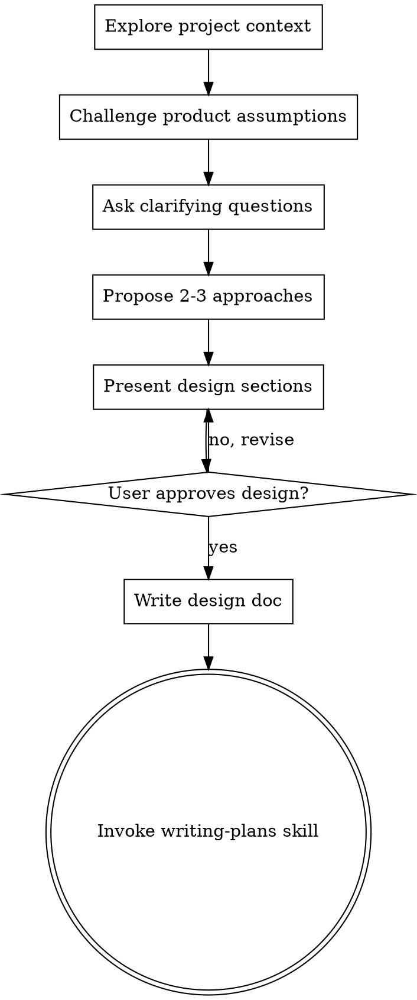

# Brainstorming Ideas Into Designs

## Overview

Help turn ideas into fully formed designs and specs through natural collaborative dialogue.

Start by understanding the current project context, then ask clarifying questions in smart batches. Once you understand what you're building, present the design and get user approval.

<HARD-GATE>
Do NOT invoke any implementation skill, write any code, scaffold any project, or take any implementation action until you have presented a design and the user has approved it. This applies to EVERY project regardless of perceived simplicity.
</HARD-GATE>

## Anti-Pattern: "This Is Too Simple To Need A Design"

Every project goes through this process. A todo list, a single-function utility, a config change — all of them. "Simple" projects are where unexamined assumptions cause the most wasted work. The design can be short (a few sentences for truly simple projects), but you MUST present it and get approval.

## Checklist

You MUST create a task for each of these items and complete them in order:

1. **Explore project context** — check files, docs, recent commits
2. **Challenge product assumptions** — proactively question the framing before accepting it
3. **Ask clarifying questions** — in smart batches, understand purpose/constraints/success criteria
4. **Propose 2-3 approaches** — with trade-offs and your recommendation
5. **Present design** — in sections scaled to their complexity, get user approval after each section
6. **Write design doc** — save to `docs/plans/YYYY-MM-DD-<topic>-design.md` and commit
7. **Transition to implementation** — invoke writing-plans skill to create implementation plan

## Process Flow

**The terminal state is invoking writing-plans.** Do NOT invoke frontend-design, mcp-builder, or any other implementation skill. The ONLY skill you invoke after brainstorming is writing-plans.

## Challenging Product Assumptions

Before diving into clarifying questions, take a moment to challenge the framing of the request. This is what a senior PM or founding product designer would naturally do — push back on assumptions before committing to a solution.

**Challenge questions to consider:**

- "Which user state/lifecycle does this feature serve, and what problem does it solve for them?"
- "If we build this, what would users actually do with it?"
- "Does this assumption still hold in the scaled / multi-tenant version of the product?"
- "Is there a simpler or lower-cost alternative that solves the same problem?"
- "Who is this for and what would they actually do with it?"

**Example:**

User says: "I want all users to have their own public page — rename the creator page to user page"

Without challenge: Skill proceeds to design a user page feature.

With challenge: Skill asks "A public page is meaningful when there's content to show. What would a non-creator user put on their page? Who would visit it?" — which surfaces that the feature may not be needed at this stage.

The user then reconsiders the assumption entirely, saving implementation effort.

## The Process

**Understanding the idea:**
- Check out the current project state first (files, docs, recent commits)
- Focus on understanding: purpose, constraints, success criteria
- Prefer multiple-choice questions when possible, but open-ended is fine too

**Asking questions — smart batching:**
- Classify questions as **text** (word-described choices) or **visual** (need ASCII mockups to compare)
- Ask all text questions first, visual questions last
- Batch up to 4 independent text questions per AskUserQuestion call; use multiple batches if more than 4
- Never dump all questions with a single "all correct / some not correct" toggle — each question gets its own options
- Ask visual questions **one at a time**, using the `markdown` preview field on each option for ASCII mockups
- When a question involves an ambiguous concept, briefly explain the difference and offer each interpretation as a separate option

**Exploring approaches:**
- Propose 2-3 different approaches with trade-offs
- Present options conversationally with your recommendation and reasoning
- Lead with your recommended option and explain why

**Presenting the design:**
- Once you believe you understand what you're building, present the design
- Scale each section to its complexity: a few sentences if straightforward, up to 200-300 words if nuanced
- Ask after each section whether it looks right so far
- Cover: architecture, components, data flow, error handling, testing
- Be ready to go back and clarify if something doesn't make sense

## After the Design

**Documentation:**
- Write the validated design to `docs/plans/YYYY-MM-DD-<topic>-design.md`
- Use elements-of-style:writing-clearly-and-concisely skill if available
- Commit the design document to git

**Implementation:**
- Invoke the writing-plans skill to create a detailed implementation plan
- Do NOT invoke any other skill. writing-plans is the next step.

## Native Task Integration

Use Claude Code's native task management to track checklist progress:

- **At skill start:** Call `TaskCreate` for each checklist item (explore context, challenge assumptions, ask questions, propose approaches, present design, write doc, transition)
- **Set dependencies:** Each task should have `blockedBy` referencing the previous task, enforcing sequential completion
- **During execution:** Call `TaskUpdate` to mark tasks `in_progress` when starting, `completed` when done
- **Before handoff:** Call `TaskList` to verify all brainstorming tasks are complete before invoking writing-plans

## Key Principles

- **Batch independent text questions** — up to 4 per AskUserQuestion call, multiple batches if more than 4
- **Visual questions last, one at a time** — use `markdown` preview field for ASCII mockups
- **Surface implicit alternatives** — don't assume; offer interpretations as options with brief explanations
- **Multiple-choice preferred** — easier to answer than open-ended when possible
- **YAGNI ruthlessly** — remove unnecessary features from all designs
- **Explore alternatives** — always propose 2-3 approaches before settling
- **Incremental validation** — present design, get approval before moving on
- **Be flexible** — go back and clarify when something doesn't make sense
