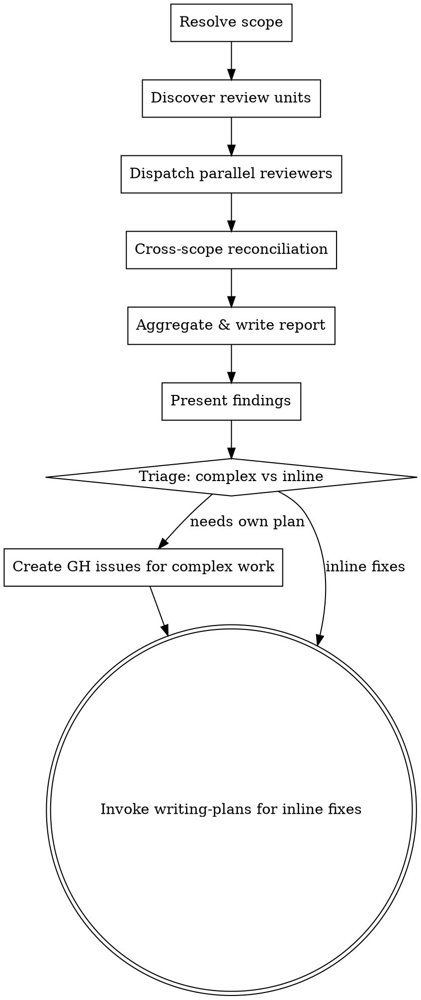

# Codebase Review

## Overview

Audit an entire codebase (or a specified directory) for code quality issues, produce a ranked report, and route fixes through the appropriate workflow.

**Core principle:** Periodic whole-repo audits catch issues that per-task and per-feature reviews miss -- cross-module duplication, accumulated complexity, and style drift.

**Announce at start:** "I'm using the codebase-review skill to audit the codebase."

## When to Use

- Periodic codebase health checks ("review the codebase", "audit code quality")
- When asked to find DRY violations, dead code, unnecessary complexity, refactoring opportunities
- When asked to "simplify the codebase" or "clean up the code" at repo scale
- After many features have landed and quality may have drifted

**Not for:**
- Reviewing a specific feature branch -> use `implementation-review`
- Reviewing changed files only -> use built-in `/simplify`
- Per-task review during development -> use `requesting-code-review`

## Invocation

`/codebase-review` -- review entire repo (default)
`/codebase-review path/to/dir` -- review only that directory

## Review Categories

| Category | What it checks | Criticality Range |
|----------|---------------|-------------------|
| **DRY** | Duplicated code blocks, repeated constants/magic numbers, copy-pasted logic with minor variations | Medium - High |
| **YAGNI** | Unused exports/functions, dead code paths, speculative features, unnecessary config options | Low - High |
| **Simplicity & Efficiency** | Over-abstracted code, unnecessary indirection, verbose implementations that could be simpler, premature generalization, redundant operations, suboptimal data structures | Medium - Critical |
| **Refactoring Opportunities** | SRP violations, deep nesting, long parameter lists, God objects, missing abstractions that would simplify multiple callers | Low - High |
| **Consistency** | Naming drift (camelCase vs snake_case mixed), inconsistent error handling, style divergence across modules | Low - Medium |

**Criticality levels:**
- **Critical** -- Active bug risk or severe performance issue
- **High** -- Significant maintenance burden or correctness risk
- **Medium** -- Code smell that makes the codebase harder to work with
- **Low** -- Minor style/convention issue

## The Process



### Phase 1 -- Resolve Scope & Discover Review Units

1. If path argument provided, use that directory as the single review unit
2. If no argument, use git root: `git rev-parse --show-toplevel`
3. Discover top-level directories as review units:
   ```bash
   # List directories, excluding hidden dirs and common non-code dirs
   find "$SCOPE" -maxdepth 1 -type d ! -name '.*' ! -name 'node_modules' ! -name 'vendor' ! -name '__pycache__' | sort
   ```
4. Create one task per review unit using `TaskCreate`

### Phase 2 -- Dispatch Parallel Reviewers

For each review unit, dispatch an **Explore** subagent using the `reviewer-prompt.md` template with:
- `{SCOPE_PATH}` -- the directory to review

Categories and criticality levels are hardcoded in the template (they don't change per invocation).

All subagents run in parallel (no dependencies between them). Each returns structured findings.

### Phase 3 -- Cross-Scope Reconciliation

After all Phase 2 subagents complete, dispatch one additional **Explore** subagent using `cross-scope-reviewer-prompt.md` with:
- `{ALL_FINDINGS}` -- concatenated findings from all Phase 2 reviewers
- `{FILE_MANIFEST}` -- list of all files in the repo with brief descriptions
- `{SCOPE_PATH}` -- the root scope being reviewed

This subagent looks specifically for cross-directory issues that individual reviewers couldn't detect.

### Phase 4 -- Aggregate, Report & Triage

1. Merge all findings (Phase 2 + Phase 3), deduplicate
2. Rank: Critical > High > Medium > Low, then by category
3. For each finding, classify fix complexity:
   - **Inline** -- fixable in a few lines, no separate planning needed
   - **Needs own plan** -- multi-file change, architectural decision, or requires its own brainstorming/design cycle
4. Write report to `docs/reviews/YYYY-MM-DD-codebase-review.md`
5. Present summary in conversation
6. For "needs own plan" items: use the `AskUserQuestion` tool (Claude Code built-in) to let user select which become GitHub issues, then create via `gh issue create`
7. For inline fixes: transition to `writing-plans` to create an implementation plan and run through the normal pipeline

## Report Format

```markdown
# Codebase Review -- YYYY-MM-DD
**Scope:** [repo root or specified path]
**Review units:** [list of directories reviewed]

## Summary
- X findings total (N Critical, N High, N Medium, N Low)
- Y items deferred (need own plan -> GH issues)
- Z items fixable inline (proceeding to implementation)

## Findings

### Critical
| # | Category | File(s) | Description | Fix Complexity |
|---|----------|---------|-------------|----------------|
| 1 | ... | ... | ... | Inline / Needs own plan |

### High
...

### Medium
...

### Low
...

## Deferred Work
| # | Finding | Rationale for deferral | GitHub Issue |
|---|---------|----------------------|--------------|
| ... | ... | ... | #NN |

## Methodology
Categories: DRY, YAGNI, Simplicity & Efficiency, Refactoring Opportunities, Consistency
Approach: Parallel scope review (N units) + cross-scope reconciliation
```

## Common Mistakes

### Reviewing only changed files
- **Problem:** Misses accumulated issues across the whole codebase
- **Fix:** Always review the full scope, not just recent diffs

### Severity-based issue creation
- **Problem:** Creating GH issues for all Critical/High findings regardless of fix complexity
- **Fix:** Issue creation is based on fix COMPLEXITY, not severity. A Critical one-liner doesn't need an issue.

### Skipping cross-scope reconciliation
- **Problem:** Cross-directory DRY violations and naming drift go undetected
- **Fix:** Always run the reconciliation pass after parallel reviews

## Red Flags

**Never:**
- Skip the cross-scope reconciliation pass
- Auto-create GH issues without user confirmation
- Route complex multi-file refactors through inline fixes
- Proceed to fixes without writing the report first

**Always:**
- Let the user decide which complex items become GH issues
- Write the report before starting any fixes
- Route inline fixes through writing-plans (not ad-hoc edits)

## Integration

**Standalone skill** -- invoked directly by the user.

**Leads to:**
- **writing-plans** -- for inline fixes after the review
- **GitHub Issues** -- for complex work that needs its own brainstorming cycle

**Related but different:**
- **implementation-review** -- reviews a feature branch, not the whole codebase
- **`/simplify` (built-in)** -- reviews changed files only, no persistent report
