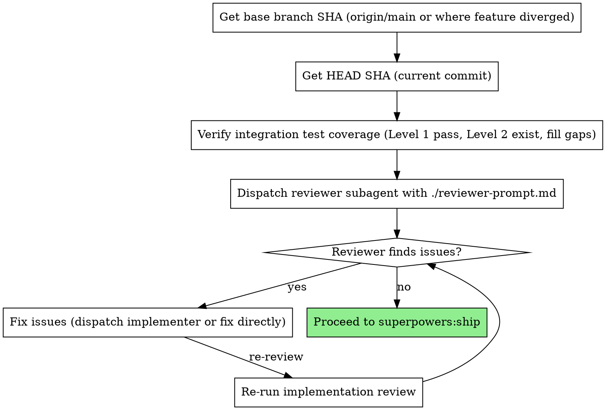

# Implementation Review

Review the entire feature implementation with fresh eyes, focusing on issues that only surface when looking at all tasks together.

**Core principle:** Per-task reviews verify each piece works. Implementation review verifies the pieces work together — through both code review and integration tests.

## When to Use

- After all tasks complete in subagent-driven-development (auto-suggested)
- Before merging any multi-task feature branch
- When asked to "review the whole thing" or "look at everything with fresh eyes"

**Not needed for:** Single-task changes, hotfixes, documentation-only PRs.

## The Process



## Integration Test Verification (Before Review)

By this point, integration tests should already exist from the implementation phase:

| Level | Source | Expected State |
|-------|--------|----------------|
| **Level 1: Broad acceptance tests** | Task 0 (written before implementation) | Should now PASS (GREEN) |
| **Level 2: Narrow boundary tests** | Per-task TDD (at cross-task seams) | Should PASS |
| **Level 3: This step** | Orchestrator verification | Fill gaps if any |

Before dispatching the reviewer:

1. **Run Level 1 tests** — Task 0's broad integration tests should all pass. If any fail, the feature isn't done. Fix before proceeding.
2. **Spot-check Level 2 tests** — at each cross-task seam, verify a boundary test exists using real components.
3. **Fill gaps** — if boundary tests are missing at a seam, write them now and commit.

**Skip verification when:** Single-module change, no cross-task data flow, or purely additive tasks with no interactions (e.g., adding independent utility functions).

The reviewer will then assess whether coverage is adequate across all three levels and flag remaining gaps.

## How to Dispatch

```bash
# Get the FULL feature range — not just the last task
BASE_SHA=$(git merge-base HEAD origin/main)  # or origin/master
HEAD_SHA=$(git rev-parse HEAD)
```

Then dispatch using `./reviewer-prompt.md` template with:
- `{BASE_SHA}` — where the feature branch diverged
- `{HEAD_SHA}` — current tip
- `{FEATURE_SUMMARY}` — what the feature does (1-2 sentences)
- `{TASK_LIST}` — list of tasks that were implemented
- `{PLAN_FILE_PATH}` — path to the plan document (contains completion report)

**Critical:** Always use `model: "opus"` for the reviewer subagent. Fresh-eyes review requires the strongest reasoning model to catch subtle cross-task issues.

**Critical:** The diff range must cover ALL tasks, not just the last one. This is the entire point of the skill.

## What It Catches (That Per-Task Reviews Miss)

| Category | Example | Why Per-Task Misses It |
|----------|---------|----------------------|
| Cross-task inconsistency | Config says port 3000, README says 8080 | Each file reviewed in isolation |
| Duplicated constants | Same timeout defined in two modules | Each task added it independently |
| Code duplication | Identical function in two files, different names | Each task's reviewer only sees one copy |
| Dead code from iteration | Conditional where both branches are identical | Emerged from incremental changes across tasks |
| Documentation gaps | Feature supported in one module but not another, undocumented | Per-task reviewer sees one side |
| Unclear/inconsistent errors | Multiple modules throw same generic message | Each reviewer sees one throw site |
| Missing boundary tests | Components interact but no Level 2 boundary test at the seam | Per-task reviewer sees one side |

## Red Flags

**Never:**
- Use per-task SHA range (defeats the purpose)
- Skip this because per-task reviews passed (that's exactly when cross-task issues hide)
- Treat this as optional for multi-task features

**If reviewer finds issues:**
- Fix them before proceeding to ship
- Re-run the review after fixes
- Don't skip re-review

## Post-Review: Plan Doc Updates

After the implementation review passes (all issues fixed, re-review clean), the **orchestrator** (not the reviewer subagent) updates the plan document:

**Document fixups:**
- Append an `### Implementation Review Changes` subsection to the existing `## Completion Report` section
- List each change made during review fixups (e.g., "Fixed inconsistent port config across modules")
- If no fixups were needed, omit this subsection

**Write handoff notes (multi-phase plans only):**
- If the plan has future phases, write handoff notes directly into the next phase's section
- Insert as a blockquote before the task checklist:
  ```markdown
  > **Handoff from Phase N:**
  > - [Thing the next phase needs to know]
  > - [API shape changes, new dependencies, scope adjustments]
  ```
- Handoff notes should cover: API/interface changes from what the plan originally assumed, new dependencies introduced, scope adjustments that affect future phases
- If there's nothing to hand off, don't add the blockquote

## Integration

**Auto-dispatched by:**
- **superpowers:subagent-driven-development** — reviewer dispatched after all tasks complete

**For standalone use:** Invoke this skill directly when reviewing an implementation outside the normal workflow.

**Leads to:**
- **superpowers:ship** — once review passes, auto-invoked to commit, push, and create PR
