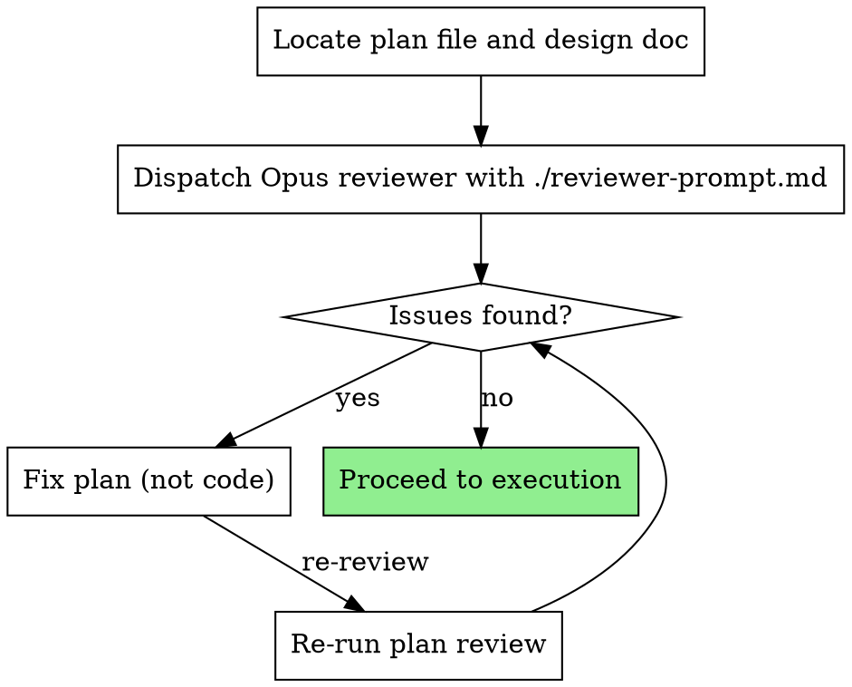

# Plan Review

## Overview

Dispatch an Opus subagent to review a written plan for internal consistency and alignment with the design doc before any code gets written. Catches issues that are cheap to fix in a plan but expensive to fix mid-implementation.

**Core principle:** Plans are hypotheses about how to build something. Validate the hypothesis before running the experiment.

**Announce at start:** "I'm using the plan-review skill to validate this plan before execution."

## When to Use

- After writing-plans produces a plan document
- Before subagent-driven-development begins
- When resuming work on a plan that's been idle (context may have drifted)

**Not needed for:** Single-task plans, hotfix plans, plans with no design doc reference.

## The Process

## How to Dispatch

Gather inputs:
- **Plan file path** — e.g. `docs/plans/2026-02-25-feature.md`
- **Design doc path** — if one exists (from brainstorming or prior work)
- **Codebase root** — the repo/worktree the plan targets

Then dispatch using `./reviewer-prompt.md` template with:
- `{PLAN_PATH}` — path to the plan document
- `{DESIGN_DOC_PATH}` — path to design doc (or "None" if no design doc)
- `{REPO_PATH}` — codebase root for verifying file paths against existing code

**Critical:** Always use `model: "opus"` for the reviewer subagent. Consistency checking requires strong reasoning to trace dependencies across tasks.

## What It Catches

| Category | Example | Why the Planner Misses It |
|----------|---------|--------------------------|
| Dependency ordering | Task 4 imports a util created in Task 6 | Planner thinks about tasks as units, not their sequencing |
| File path drift | Task 2 creates `src/utils.ts`, Task 5 imports from `src/helpers.ts` | Renaming during planning without updating all references |
| Design doc mismatch | Design says REST API, plan implements GraphQL | Plan diverged from design during task decomposition |
| Missing tasks | Design specifies auth middleware, plan has no auth task | Scope items lost during decomposition |
| Phantom dependencies | Task tests a function that no task ever creates | Copy-paste from similar plan, not adapted |
| Inconsistent naming | `UserService` in one task, `userService` in another | Each task written in isolation |
| Impossible test expectations | Test expects return value X but implementation returns Y | Test and implementation steps written at different times |
| Tech stack contradictions | Plan header says SQLite, Task 3 uses PostgreSQL syntax | Header written first, tasks written later with different assumptions |
| Implied context | Task says "modify the auth handler" without specifying file | Planner has conversation context that won't exist during execution |
| Missing mandatory fields | Task has no verification command or measurable done criteria | Planner assumes executor will figure it out |

## Red Flags

**Never:**
- Skip this because "the plan looks fine" (that's what the planner always thinks)
- Fix issues by editing code (there is no code yet — fix the plan)
- Let minor issues slide (they compound during implementation)

**If reviewer finds issues:**
- Fix the plan document
- Update `.tasks.json` if task structure changed
- Re-run review after fixes
- Don't skip re-review

## Integration

**Auto-dispatched by:**
- **superpowers:writing-plans** — reviewer subagent dispatched directly after plan is saved

**For standalone use:** Invoke this skill directly when reviewing a plan outside the writing-plans workflow.

**Leads to:**
- **superpowers:subagent-driven-development** — once review passes
