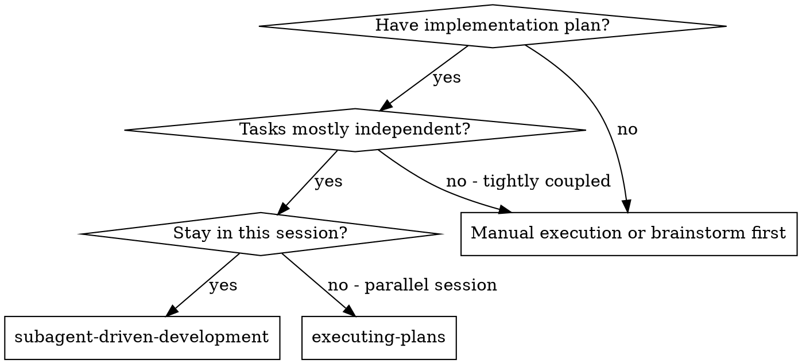
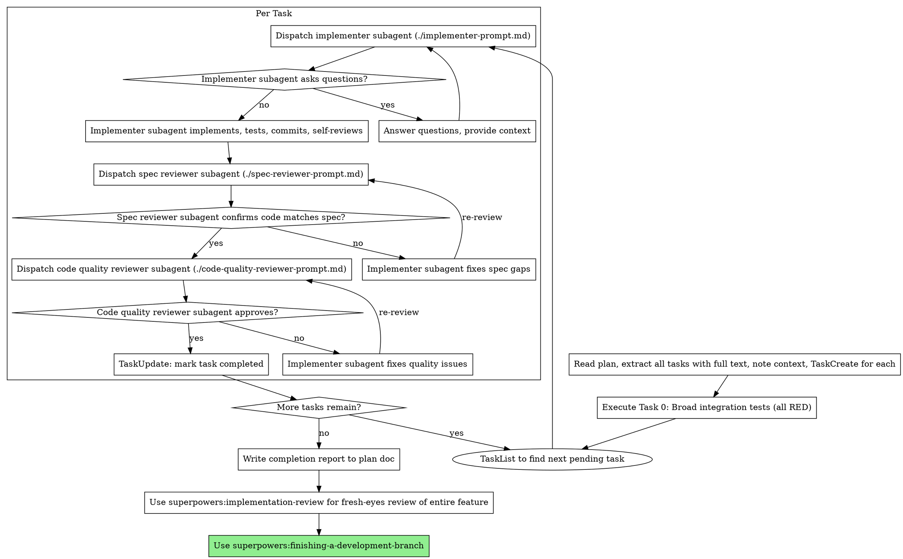

# Subagent-Driven Development

Execute plan by dispatching fresh subagent per task, with two-stage review after each: spec compliance review first, then code quality review.

**Core principle:** Fresh subagent per task + two-stage review (spec then quality) = high quality, fast iteration

## When to Use



**vs. Executing Plans (parallel session):**
- Same session (no context switch)
- Fresh subagent per task (no context pollution)
- Two-stage review after each task: spec compliance first, then code quality
- Faster iteration (no human-in-loop between tasks)

## The Process



## Prompt Templates

- `./implementer-prompt.md` - Dispatch implementer subagent
- `./spec-reviewer-prompt.md` - Dispatch spec compliance reviewer subagent
- `./code-quality-reviewer-prompt.md` - Dispatch code quality reviewer subagent

## Example Workflow

```
You: I'm using Subagent-Driven Development to execute this plan.

[Read plan file once: docs/plans/YYYY-MM-DD-feature/plan-feature.md]
[Extract all 5 tasks with full text and context]
[Create TaskCreate/TaskUpdate with all tasks]

Task 0: Broad integration tests

[Dispatch implementer subagent for Task 0]
Implementer: Created test_feature_e2e.py with 4 failing tests.
  Created stub files for modules. All tests RED as expected. Committed.

[Spec + code quality review pass]
[Mark Task 0 complete]

Task 1: Hook installation script

[Get Task 1 text and context (already extracted)]
[Dispatch implementation subagent with full task text + context]

Implementer: "Before I begin - should the hook be installed at user or system level?"

You: "User level (~/.config/superpowers/hooks/)"

Implementer: "Got it. Implementing now..."
[Later] Implementer:
  - Implemented install-hook command
  - Added tests, 5/5 passing
  - Self-review: Found I missed --force flag, added it
  - Committed

[Dispatch spec compliance reviewer]
Spec reviewer: ✅ Spec compliant - all requirements met, nothing extra

[Get git SHAs, dispatch code quality reviewer]
Code reviewer: Strengths: Good test coverage, clean. Issues: None. Approved.

[Mark Task 1 complete]

Task 2: Recovery modes

[Get Task 2 text and context (already extracted)]
[Dispatch implementation subagent with full task text + context]

Implementer: [No questions, proceeds]
Implementer:
  - Added verify/repair modes
  - 8/8 tests passing
  - Self-review: All good
  - Committed

[Dispatch spec compliance reviewer]
Spec reviewer: ❌ Issues:
  - Missing: Progress reporting (spec says "report every 100 items")
  - Extra: Added --json flag (not requested)

[Implementer fixes issues]
Implementer: Removed --json flag, added progress reporting

[Spec reviewer reviews again]
Spec reviewer: ✅ Spec compliant now

[Dispatch code quality reviewer]
Code reviewer: Strengths: Solid. Issues (Important): Magic number (100)

[Implementer fixes]
Implementer: Extracted PROGRESS_INTERVAL constant

[Code reviewer reviews again]
Code reviewer: ✅ Approved

[Mark Task 2 complete]

...

[After all tasks]
[Verify Task 0 broad integration tests now pass (GREEN)]

[Use superpowers:implementation-review — fresh-eyes review of entire feature]
Implementation reviewer: Found 2 cross-task issues:
  - Duplicated constant in fetcher.ts and cache.ts
  - Error message in cli.ts doesn't explain what went wrong

[Fix cross-task issues, re-run implementation review]
Implementation reviewer: No cross-task issues remaining

[Use superpowers:finishing-a-development-branch]
Done!
```

**Integration test levels:** Task 0 provides Level 1 (broad acceptance tests, written first). Each implementer writes Level 2 (boundary tests at cross-task seams, during TDD). Implementation-review provides Level 3 (coverage verification). See @testing-anti-patterns.md Anti-Pattern 5 for details.

## Advantages

**vs. Manual execution:**
- Subagents follow TDD naturally
- Fresh context per task (no confusion)
- Parallel-safe (subagents don't interfere)
- Subagent can ask questions (before AND during work)

**vs. Executing Plans:**
- Same session (no handoff)
- Continuous progress (no waiting)
- Review checkpoints automatic

**Efficiency gains:**
- No file reading overhead (controller provides full text)
- Controller curates exactly what context is needed
- Subagent gets complete information upfront
- Questions surfaced before work begins (not after)

**Quality gates:**
- Self-review catches issues before handoff
- Two-stage review: spec compliance, then code quality
- Review loops ensure fixes actually work
- Spec compliance prevents over/under-building
- Code quality ensures implementation is well-built

**Cost:**
- More subagent invocations (implementer + 2 reviewers per task)
- Controller does more prep work (extracting all tasks upfront)
- Review loops add iterations
- But catches issues early (cheaper than debugging later)

## Deviation Rules

When reality diverges from the plan, follow these rules in order:

| Rule | Trigger | Action | Permission |
|------|---------|--------|------------|
| **Rule 1: Auto-fix bugs** | Code doesn't work as intended | Fix inline, commit, document | No user permission needed |
| **Rule 2: Auto-add missing critical** | Missing error handling, validation, auth | Fix inline, commit, document | No user permission needed |
| **Rule 3: Auto-fix blockers** | Missing dep, broken import, wrong types | Fix inline, commit, document | No user permission needed |
| **Rule 4: STOP for architectural changes** | New DB table, library swap, breaking API change | **Stop and ask user** | Requires explicit user decision |

**Scope boundary:** Only auto-fix issues directly caused by the current task's changes. Pre-existing issues go to a deferred list — note them in the task completion report but don't fix them.

**Fix attempt limit:** After 3 auto-fix attempts on a single issue, stop and document the remaining problem. Don't loop indefinitely.

**Documentation:** For every Rule 1-3 deviation, the implementer subagent must include in its completion report:
- What deviated from the plan
- What was done to fix it
- Which rule applied

The orchestrator includes deviation summaries in the final report.

## Plan Doc Updates

The orchestrator updates the plan document during execution to maintain a living record.

**On first task start:**
1. Read the plan file
2. Change the frontmatter `status: Not Yet Started` to `status: In Development`
3. Change the current phase's `**Status:** Not Yet Started` to `**Status:** In Development`

**On each task completion:**
1. In the plan file's phase checklist, change `- [ ] Task N: ...` to `- [x] Task N: ...` for the completed task

**After all tasks complete (before invoking implementation-review):**
1. Append a `## Completion Report — [Phase Name]` section to the end of the plan doc
2. Include:
   - `**Completed:** YYYY-MM-DD`
   - `### Summary` — 2-3 sentences describing what was built
   - `### Deviations from Plan` — each deviation with: what changed, why, and impact (files/scope affected). Include Rule 1-3 auto-fixes from the deviation log. If no deviations, write "None — implemented as planned."

**After implementation-review passes:**
1. Change the current phase's status to `**Status:** Complete (YYYY-MM-DD)`
2. If all phases are complete, change the frontmatter to `status: Complete (YYYY-MM-DD)`

## Red Flags

**Never:**
- Start implementation on main/master branch without explicit user consent
- Skip reviews (spec compliance OR code quality)
- Proceed with unfixed issues
- Dispatch multiple implementation subagents in parallel (conflicts)
- Make subagent read plan file (provide full text instead)
- Skip scene-setting context (subagent needs to understand where task fits)
- Ignore subagent questions (answer before letting them proceed)
- Accept "close enough" on spec compliance (spec reviewer found issues = not done)
- Skip review loops (reviewer found issues = implementer fixes = review again)
- Let implementer self-review replace actual review (both are needed)
- **Start code quality review before spec compliance is ✅** (wrong order)
- Move to next task while either review has open issues

**If subagent asks questions:**
- Answer clearly and completely
- Provide additional context if needed
- Don't rush them into implementation

**If reviewer finds issues:**
- Implementer (same subagent) fixes them
- Reviewer reviews again
- Repeat until approved
- Don't skip the re-review

**If subagent fails task:**
- Dispatch fix subagent with specific instructions
- Don't try to fix manually (context pollution)

## Integration

**Required workflow skills:**
- **superpowers:using-git-worktrees** - REQUIRED: Set up isolated workspace before starting
- **superpowers:writing-plans** - Creates the plan this skill executes
- **superpowers:requesting-code-review** - Code review template for reviewer subagents
- **superpowers:implementation-review** - Fresh-eyes review of entire feature after all tasks
- **superpowers:finishing-a-development-branch** - Complete development after all tasks

**Subagents should use:**
- **superpowers:test-driven-development** - Subagents follow TDD for each task

**Alternative workflow:**
- **superpowers:executing-plans** - Use for parallel session instead of same-session execution
